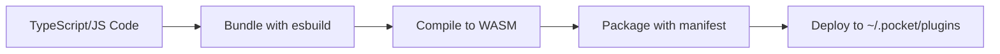

# Pocket Plugin System Specification

> **Note**: This is the original planning specification for the Pocket plugin system. All three phases have now been implemented. For current documentation, see [Plugin System Overview](docs/PLUGIN_SYSTEM.md).

## Overview

This document specifies the plugin architecture for Pocket, enabling extensible node types through a progressive enhancement strategy. The system will support built-in nodes, embedded scripting (Lua), and external plugins (WASM/RPC) while maintaining Pocket's core principles of simplicity, type safety, and clean architecture.

## Architecture Overview

```
┌─────────────────────────────────────────────────────┐
│  Phase 1: Enhanced Built-in System (Immediate)      │
│  - Leverage existing registry pattern               │
│  - Organize built-in nodes by category             │
│  - Add comprehensive node metadata                  │
├─────────────────────────────────────────────────────┤
│  Phase 2: Embedded Scripting (Near-term)           │
│  - Lua integration via go-lua                      │
│  - Sandboxed script execution                      │
│  - Simple filter/transform operations              │
├─────────────────────────────────────────────────────┤
│  Phase 3: External Plugins (Future)                │
│  - WASM for untrusted code (knqyf263/go-plugin)   │
│  - RPC for power users (hashicorp/go-plugin)      │
└─────────────────────────────────────────────────────┘
```

## Phase 1: Enhanced Built-in Node System

### Directory Structure

```
/pocket/
  /builtin/                 # All built-in nodes
    registry.go            # Central registration and metadata
    doc.go                # Package documentation
    types.go              # Shared types (NodeMetadata, Example, etc.)
    builders.go           # All node builders in one file (to avoid import cycles)
    
    # Note: We consolidated all builders into builders.go to avoid import cycles
    # between packages. In the future, we could split them if we refactor
    # to use a different pattern.
```

### Node Metadata Structure

```go
// builtin/registry.go
package builtin

import (
    "github.com/agentstation/pocket"
    "github.com/agentstation/pocket/yaml"
)

// NodeMetadata describes a node type
type NodeMetadata struct {
    Type         string                 `json:"type"`
    Category     string                 `json:"category"`
    Description  string                 `json:"description"`
    InputSchema  map[string]interface{} `json:"inputSchema,omitempty"`
    OutputSchema map[string]interface{} `json:"outputSchema,omitempty"`
    ConfigSchema map[string]interface{} `json:"configSchema"`
    Examples     []Example              `json:"examples,omitempty"`
    Since        string                 `json:"since,omitempty"`
}

// Example shows how to use a node
type Example struct {
    Name        string                 `json:"name"`
    Description string                 `json:"description"`
    Config      map[string]interface{} `json:"config"`
    Input       interface{}            `json:"input,omitempty"`
    Output      interface{}            `json:"output,omitempty"`
}

// NodeBuilder creates nodes and provides metadata
type NodeBuilder interface {
    Metadata() NodeMetadata
    Build(def *yaml.NodeDefinition) (pocket.Node, error)
}

// Registry manages all built-in nodes
type Registry struct {
    builders map[string]NodeBuilder
}

// Register adds a node builder
func (r *Registry) Register(builder NodeBuilder) {
    meta := builder.Metadata()
    r.builders[meta.Type] = builder
}

// RegisterAll registers all built-in nodes with a YAML loader
func RegisterAll(loader *yaml.Loader, verbose bool) {
    registry := &Registry{
        builders: make(map[string]NodeBuilder),
    }
    
    // Register core nodes
    registry.Register(&EchoNodeBuilder{verbose: verbose})
    registry.Register(&DelayNodeBuilder{verbose: verbose})
    registry.Register(&ConditionalNodeBuilder{verbose: verbose})
    registry.Register(&RouterNodeBuilder{verbose: verbose})
    
    // Register data nodes
    registry.Register(&TransformNodeBuilder{verbose: verbose})
    registry.Register(&TemplateNodeBuilder{verbose: verbose})
    registry.Register(&JSONPathNodeBuilder{verbose: verbose})
    registry.Register(&AggregateNodeBuilder{verbose: verbose})
    registry.Register(&ValidateNodeBuilder{verbose: verbose})
    
    // Register I/O nodes
    registry.Register(&HTTPNodeBuilder{verbose: verbose})
    registry.Register(&FileNodeBuilder{verbose: verbose})
    
    // Register flow nodes
    registry.Register(&ParallelNodeBuilder{verbose: verbose})
    registry.Register(&RetryNodeBuilder{verbose: verbose})
    registry.Register(&CacheNodeBuilder{verbose: verbose})
    
    // Register all with YAML loader
    for _, builder := range registry.builders {
        meta := builder.Metadata()
        loader.RegisterNodeType(meta.Type, builder.Build)
    }
}
```

### Core Node Implementations

#### 1. Conditional Node (builtin/core/conditional.go)

```go
package core

import (
    "context"
    "fmt"
    "text/template"
    
    "github.com/agentstation/pocket"
    "github.com/agentstation/pocket/builtin"
    "github.com/agentstation/pocket/yaml"
)

// ConditionalNodeBuilder builds conditional routing nodes
type ConditionalNodeBuilder struct {
    verbose bool
}

func (b *ConditionalNodeBuilder) Metadata() builtin.NodeMetadata {
    return builtin.NodeMetadata{
        Type:        "conditional",
        Category:    "core",
        Description: "Routes to different nodes based on conditions",
        ConfigSchema: map[string]interface{}{
            "type": "object",
            "properties": map[string]interface{}{
                "conditions": map[string]interface{}{
                    "type": "array",
                    "items": map[string]interface{}{
                        "type": "object",
                        "properties": map[string]interface{}{
                            "if":   map[string]interface{}{"type": "string"},
                            "then": map[string]interface{}{"type": "string"},
                        },
                        "required": []string{"if", "then"},
                    },
                },
                "else": map[string]interface{}{
                    "type":        "string",
                    "description": "Default route if no conditions match",
                },
            },
            "required": []string{"conditions"},
        },
        Examples: []builtin.Example{
            {
                Name: "Route by score",
                Config: map[string]interface{}{
                    "conditions": []map[string]interface{}{
                        {"if": "{{gt .score 0.8}}", "then": "high"},
                        {"if": "{{gt .score 0.5}}", "then": "medium"},
                    },
                    "else": "low",
                },
            },
        },
    }
}

func (b *ConditionalNodeBuilder) Build(def *yaml.NodeDefinition) (pocket.Node, error) {
    // Extract conditions
    conditionsRaw, ok := def.Config["conditions"].([]interface{})
    if !ok {
        return nil, fmt.Errorf("conditions must be an array")
    }
    
    type condition struct {
        expr  *template.Template
        route string
    }
    
    var conditions []condition
    for i, c := range conditionsRaw {
        cond, ok := c.(map[string]interface{})
        if !ok {
            return nil, fmt.Errorf("condition %d must be an object", i)
        }
        
        ifExpr, ok := cond["if"].(string)
        if !ok {
            return nil, fmt.Errorf("condition %d missing 'if'", i)
        }
        
        thenRoute, ok := cond["then"].(string)
        if !ok {
            return nil, fmt.Errorf("condition %d missing 'then'", i)
        }
        
        tmpl, err := template.New(fmt.Sprintf("cond_%d", i)).Parse(ifExpr)
        if err != nil {
            return nil, fmt.Errorf("condition %d invalid template: %w", i, err)
        }
        
        conditions = append(conditions, condition{
            expr:  tmpl,
            route: thenRoute,
        })
    }
    
    defaultRoute, _ := def.Config["else"].(string)
    
    return pocket.NewNode[any, any](def.Name,
        pocket.WithPost(func(ctx context.Context, store pocket.StoreWriter, input, prep, exec any) (any, string, error) {
            // Evaluate conditions in order
            for _, cond := range conditions {
                var buf bytes.Buffer
                if err := cond.expr.Execute(&buf, exec); err != nil {
                    continue // Skip failed conditions
                }
                
                // Check if result is truthy
                result := strings.TrimSpace(buf.String())
                if result == "true" || result == "1" {
                    if b.verbose {
                        log.Printf("[%s] Condition matched, routing to: %s", def.Name, cond.route)
                    }
                    return exec, cond.route, nil
                }
            }
            
            // No conditions matched, use default
            if b.verbose {
                log.Printf("[%s] No conditions matched, routing to: %s", def.Name, defaultRoute)
            }
            return exec, defaultRoute, nil
        }),
    ), nil
}
```

#### 2. HTTP Node (builtin/io/http.go)

```go
package io

import (
    "context"
    "encoding/json"
    "fmt"
    "io"
    "net/http"
    "time"
    
    "github.com/agentstation/pocket"
    "github.com/agentstation/pocket/builtin"
    "github.com/agentstation/pocket/yaml"
)

// HTTPNodeBuilder builds HTTP client nodes
type HTTPNodeBuilder struct {
    verbose bool
}

func (b *HTTPNodeBuilder) Metadata() builtin.NodeMetadata {
    return builtin.NodeMetadata{
        Type:        "http",
        Category:    "io",
        Description: "Makes HTTP requests with retry and timeout support",
        ConfigSchema: map[string]interface{}{
            "type": "object",
            "properties": map[string]interface{}{
                "url": map[string]interface{}{
                    "type":        "string",
                    "description": "URL to request (supports templating)",
                },
                "method": map[string]interface{}{
                    "type":        "string",
                    "enum":        []string{"GET", "POST", "PUT", "DELETE", "PATCH"},
                    "default":     "GET",
                },
                "headers": map[string]interface{}{
                    "type":        "object",
                    "description": "HTTP headers",
                },
                "timeout": map[string]interface{}{
                    "type":        "string",
                    "default":     "30s",
                    "description": "Request timeout",
                },
                "retry": map[string]interface{}{
                    "type": "object",
                    "properties": map[string]interface{}{
                        "max_attempts": map[string]interface{}{"type": "integer", "default": 3},
                        "delay":        map[string]interface{}{"type": "string", "default": "1s"},
                    },
                },
            },
            "required": []string{"url"},
        },
        OutputSchema: map[string]interface{}{
            "type": "object",
            "properties": map[string]interface{}{
                "status":  map[string]interface{}{"type": "integer"},
                "headers": map[string]interface{}{"type": "object"},
                "body":    map[string]interface{}{"type": ["object", "string"]},
            },
        },
        Examples: []builtin.Example{
            {
                Name: "GET request",
                Config: map[string]interface{}{
                    "url":    "https://api.example.com/data",
                    "method": "GET",
                },
            },
            {
                Name: "POST with retry",
                Config: map[string]interface{}{
                    "url":    "https://api.example.com/submit",
                    "method": "POST",
                    "headers": map[string]interface{}{
                        "Content-Type": "application/json",
                    },
                    "retry": map[string]interface{}{
                        "max_attempts": 5,
                        "delay":        "2s",
                    },
                },
            },
        },
    }
}

func (b *HTTPNodeBuilder) Build(def *yaml.NodeDefinition) (pocket.Node, error) {
    url, _ := def.Config["url"].(string)
    method, _ := def.Config["method"].(string)
    if method == "" {
        method = "GET"
    }
    
    headers := make(map[string]string)
    if h, ok := def.Config["headers"].(map[string]interface{}); ok {
        for k, v := range h {
            headers[k] = fmt.Sprint(v)
        }
    }
    
    timeoutStr, _ := def.Config["timeout"].(string)
    timeout, _ := time.ParseDuration(timeoutStr)
    if timeout == 0 {
        timeout = 30 * time.Second
    }
    
    // Parse retry config
    maxAttempts := 3
    retryDelay := time.Second
    if retry, ok := def.Config["retry"].(map[string]interface{}); ok {
        if ma, ok := retry["max_attempts"].(int); ok {
            maxAttempts = ma
        }
        if d, ok := retry["delay"].(string); ok {
            if pd, err := time.ParseDuration(d); err == nil {
                retryDelay = pd
            }
        }
    }
    
    return pocket.NewNode[any, any](def.Name,
        pocket.WithExec(func(ctx context.Context, input any) (any, error) {
            // Support URL templating
            finalURL := url // TODO: Template expansion
            
            client := &http.Client{
                Timeout: timeout,
            }
            
            var lastErr error
            for attempt := 0; attempt < maxAttempts; attempt++ {
                if attempt > 0 {
                    if b.verbose {
                        log.Printf("[%s] Retry attempt %d/%d", def.Name, attempt+1, maxAttempts)
                    }
                    time.Sleep(retryDelay)
                }
                
                req, err := http.NewRequestWithContext(ctx, method, finalURL, nil)
                if err != nil {
                    return nil, err
                }
                
                // Add headers
                for k, v := range headers {
                    req.Header.Set(k, v)
                }
                
                // TODO: Add body for POST/PUT/PATCH
                
                resp, err := client.Do(req)
                if err != nil {
                    lastErr = err
                    continue
                }
                defer resp.Body.Close()
                
                body, err := io.ReadAll(resp.Body)
                if err != nil {
                    lastErr = err
                    continue
                }
                
                // Parse JSON if content type is JSON
                var bodyData interface{} = string(body)
                if resp.Header.Get("Content-Type") == "application/json" {
                    var jsonData interface{}
                    if err := json.Unmarshal(body, &jsonData); err == nil {
                        bodyData = jsonData
                    }
                }
                
                result := map[string]interface{}{
                    "status":  resp.StatusCode,
                    "headers": resp.Header,
                    "body":    bodyData,
                }
                
                // Retry on 5xx errors
                if resp.StatusCode >= 500 && attempt < maxAttempts-1 {
                    lastErr = fmt.Errorf("server error: %d", resp.StatusCode)
                    continue
                }
                
                return result, nil
            }
            
            return nil, fmt.Errorf("all attempts failed: %w", lastErr)
        }),
    ), nil
}
```

### Built-in Node Categories

#### Core Nodes
1. **echo** - Output a message with input passthrough
2. **delay** - Delay execution for a specified duration
3. **router** - Route to different nodes based on static configuration
4. **conditional** - Dynamic routing based on template expressions

#### Data Manipulation Nodes
1. **transform** - Transform data using expressions
2. **template** - Render Go templates with input data
3. **jsonpath** - Extract data using JSONPath expressions
4. **aggregate** - Collect and combine results from multiple sources
5. **validate** - Validate data against JSON Schema

#### I/O Nodes
1. **http** - Make HTTP requests with retry and timeout
2. **file** - Read/write files with path restrictions
3. **exec** - Execute shell commands with restrictions

#### Flow Control Nodes
1. **parallel** - Execute multiple nodes in parallel
2. **batch** - Process arrays in batches
3. **retry** - Retry a node with exponential backoff
4. **cache** - Cache node results with TTL
5. **circuit** - Circuit breaker pattern

## Phase 2: Lua Scripting Integration

### Script Node Implementation

```go
// builtin/script/lua.go
package script

import (
    "context"
    "fmt"
    
    "github.com/Shopify/go-lua"
    "github.com/agentstation/pocket"
    "github.com/agentstation/pocket/builtin"
    "github.com/agentstation/pocket/yaml"
)

// LuaNodeBuilder builds Lua script nodes
type LuaNodeBuilder struct {
    verbose bool
}

func (b *LuaNodeBuilder) Metadata() builtin.NodeMetadata {
    return builtin.NodeMetadata{
        Type:        "lua",
        Category:    "script",
        Description: "Execute Lua scripts for custom logic",
        ConfigSchema: map[string]interface{}{
            "type": "object",
            "properties": map[string]interface{}{
                "script": map[string]interface{}{
                    "type":        "string",
                    "description": "Lua script to execute",
                },
                "file": map[string]interface{}{
                    "type":        "string",
                    "description": "Path to Lua script file",
                },
            },
            "oneOf": []map[string]interface{}{
                {"required": []string{"script"}},
                {"required": []string{"file"}},
            },
        },
        Examples: []builtin.Example{
            {
                Name: "Filter high scores",
                Config: map[string]interface{}{
                    "script": `
                        if input.score > 0.8 then
                            return {status = "high", data = input}
                        else
                            return {status = "low", data = input}
                        end
                    `,
                },
            },
        },
    }
}

func (b *LuaNodeBuilder) Build(def *yaml.NodeDefinition) (pocket.Node, error) {
    script, hasScript := def.Config["script"].(string)
    file, hasFile := def.Config["file"].(string)
    
    if !hasScript && !hasFile {
        return nil, fmt.Errorf("either 'script' or 'file' must be specified")
    }
    
    return pocket.NewNode[any, any](def.Name,
        pocket.WithExec(func(ctx context.Context, input any) (any, error) {
            l := lua.NewState()
            defer l.Close()
            
            // Set up sandboxed environment
            setupSandbox(l)
            
            // Convert input to Lua
            pushValue(l, input)
            l.SetGlobal("input")
            
            // Load and execute script
            var err error
            if hasScript {
                err = l.DoString(script)
            } else {
                err = l.DoFile(file)
            }
            
            if err != nil {
                return nil, fmt.Errorf("lua error: %w", err)
            }
            
            // Get return value
            if l.Top() > 0 {
                result := pullValue(l, -1)
                l.Pop(1)
                return result, nil
            }
            
            return input, nil
        }),
    ), nil
}

// setupSandbox creates a safe Lua environment
func setupSandbox(l *lua.State) {
    // Remove dangerous functions
    l.PushNil()
    l.SetGlobal("dofile")
    l.PushNil()
    l.SetGlobal("loadfile")
    l.PushNil()
    l.SetGlobal("load")
    l.PushNil()
    l.SetGlobal("loadstring")
    l.PushNil()
    l.SetGlobal("require")
    l.PushNil()
    l.SetGlobal("io")
    l.PushNil()
    l.SetGlobal("os")
    
    // Add safe utilities
    // TODO: Add JSON encode/decode
    // TODO: Add string utilities
    // TODO: Add basic math functions
}
```

### Lua API Design

```lua
-- Available globals in Lua scripts:
-- input: The input data passed to the node
-- json: JSON encode/decode functions
-- string: String manipulation utilities
-- math: Mathematical functions

-- Example: Transform data
local result = {
    original = input,
    processed = true,
    timestamp = os.time()
}

-- Filter based on condition
if input.value > threshold then
    result.status = "pass"
else
    result.status = "fail"
end

-- Return value becomes node output
return result
```

## Phase 3: External Plugin Support (Future)

### WebAssembly Plugins

WebAssembly plugins allow developers to write custom nodes in languages like TypeScript, JavaScript, Rust, or Go, compile them to WASM, and run them securely within Pocket.

#### Development Workflow



#### TypeScript Plugin Example

```typescript
// src/sentiment-analyzer.ts
import { PluginNode, NodeConfig } from '@pocket/plugin-sdk';

export class SentimentAnalyzer extends PluginNode {
  async exec(input: any): Promise<any> {
    const text = input.text || '';
    
    // Simple sentiment analysis
    const positiveWords = ['good', 'great', 'excellent', 'amazing'];
    const negativeWords = ['bad', 'terrible', 'awful', 'horrible'];
    
    let score = 0;
    const words = text.toLowerCase().split(/\s+/);
    
    for (const word of words) {
      if (positiveWords.includes(word)) score++;
      if (negativeWords.includes(word)) score--;
    }
    
    return {
      text,
      sentiment: score > 0 ? 'positive' : score < 0 ? 'negative' : 'neutral',
      score
    };
  }
  
  getMetadata() {
    return {
      type: 'sentiment',
      category: 'ai',
      description: 'Simple sentiment analysis',
      configSchema: {
        type: 'object',
        properties: {
          threshold: { type: 'number', default: 0 }
        }
      }
    };
  }
}
```

#### Build Process

```bash
# 1. Bundle TypeScript to JavaScript
esbuild src/sentiment-analyzer.ts --bundle --format=esm --outfile=dist/plugin.js

# 2. Compile to WebAssembly (using Javy or similar)
javy compile dist/plugin.js -o dist/plugin.wasm

# 3. Create manifest
cat > manifest.yaml << EOF
name: sentiment-analyzer
version: 1.0.0
description: Simple sentiment analysis plugin
binary: plugin.wasm
nodes:
  - type: sentiment
    category: ai
    description: Analyze text sentiment
EOF

# 4. Package plugin
tar -czf sentiment-analyzer.tar.gz manifest.yaml dist/plugin.wasm
```

#### Plugin Manifest

```yaml
# Plugin manifest: ~/.pocket/plugins/custom-llm/manifest.yaml
name: custom-llm
version: 1.0.0
description: Custom LLM integration
author: Your Name
license: MIT
binary: custom-llm.wasm
runtime: wasm  # or 'rpc' for RPC plugins

# Node definitions
nodes:
  - type: custom-llm
    category: ai
    description: Query custom LLM
    configSchema:
      type: object
      properties:
        model:
          type: string
          default: gpt-3.5-turbo
        temperature:
          type: number
          default: 0.7
          minimum: 0
          maximum: 2

# Plugin requirements
requirements:
  pocket: ">=0.5.0"
  memory: 100MB
  
# Security permissions
permissions:
  - network: ["api.openai.com"]
  - env: ["OPENAI_API_KEY"]
```

### RPC Plugins

RPC plugins run as separate processes and communicate via gRPC, suitable for plugins that need full system access or are written in languages without WASM support.

```yaml
# RPC plugin configuration
plugins:
  rpc:
    - name: enterprise-db
      path: /usr/local/bin/pocket-enterprise-db
      checksum: sha256:abc123...
      protocol: grpc
      nodes:
        - type: enterprise-query
          category: database
```

## Implementation Tasks

### Phase 1 Tasks (Immediate)

1. **Core Infrastructure** (Priority: High)
   - [x] Create `/builtin` directory structure
   - [x] Implement `NodeMetadata` and `NodeBuilder` interfaces
   - [x] Create central registry in `builtin/registry.go`
   - [x] Implement `RegisterAll` function
   - [x] Add JSON Schema validation support

2. **Core Nodes** (Priority: High)
   - [x] Implement enhanced echo node with metadata
   - [x] Implement delay node with metadata
   - [x] Implement conditional node with template expressions
   - [x] Implement router node with static routing
   - [x] Add comprehensive tests for each node

3. **Data Nodes** (Priority: Medium)
   - [x] Implement transform node with expressions (basic version)
   - [x] Implement template node (Go templates)
   - [x] Implement jsonpath node
   - [x] Implement aggregate node
   - [x] Implement validate node (JSON Schema)

4. **I/O Nodes** (Priority: Medium)
   - [x] Implement http node with retry/timeout
   - [x] Implement file node with sandboxing
   - [x] Implement exec node with restrictions

5. **Flow Nodes** (Priority: Low)
   - [x] Implement parallel execution node
   - [ ] Implement batch processing node
   - [ ] Implement retry node
   - [ ] Implement cache node
   - [ ] Implement circuit breaker node

6. **CLI Integration** (Priority: High)
   - [x] Update `cmd/pocket/run.go` to use new registry
   - [x] Add node listing command (`pocket nodes list`)
   - [x] Add node info command (`pocket nodes info <type>`)
   - [x] Generate node documentation from metadata (`pocket nodes docs`)

### Phase 2 Tasks (Near-term)

1. **Lua Integration**
   - [x] Add Shopify/go-lua dependency
   - [x] Implement Lua script node
   - [x] Create sandboxed Lua environment
   - [x] Add JSON support to Lua (json_encode, json_decode)
   - [x] Add string utilities to Lua (str_trim, str_split, str_contains, str_replace)
   - [x] Implement script file loading
   - [x] Add Lua script examples
   - [x] Add timeout support for scripts
   - [x] Add type_of function for type checking

2. **Script Management** (Not Implemented)
   - [ ] Add script discovery from ~/.pocket/scripts
   - [ ] Implement script validation command
   - [ ] Add script debugging support

### Phase 3 Tasks (Complete)

1. **WASM Plugin Support**
   - [x] Integrate wazero (pure Go WebAssembly runtime)
   - [x] Define plugin SDK interfaces
   - [x] Implement WASM runtime and loader
   - [x] Add plugin discovery from ~/.pocket/plugins
   - [x] Create TypeScript/JavaScript SDK (@pocket/plugin-sdk)
   - [x] Add support for Javy (JS to WASM compiler)
   - [x] Implement security sandboxing and permissions
   - [x] Create example plugins (TypeScript, Rust, Go)
   - [x] Add plugin packaging and distribution tools

2. **RPC Plugin Support**
   - [ ] Integrate hashicorp/go-plugin
   - [ ] Define gRPC interfaces and protobuf schemas
   - [ ] Implement plugin lifecycle management
   - [ ] Add security/checksum validation
   - [ ] Support for plugin hot-reloading
   - [ ] Create example RPC plugins
   - [ ] Add plugin health checks and monitoring

3. **Plugin CLI Commands**
   - [x] `pocket-plugins list` - List installed plugins
   - [x] `pocket-plugins install <path>` - Install plugin from directory
   - [x] `pocket-plugins remove <name>` - Remove installed plugin
   - [x] `pocket-plugins info <name>` - Show plugin details
   - [x] `pocket-plugins validate <path>` - Validate plugin manifest

## Testing Strategy

1. **Unit Tests**: Each node implementation must have comprehensive tests
2. **Integration Tests**: Test node interactions and workflow execution
3. **Example Workflows**: Create example YAML files demonstrating each node
4. **Performance Tests**: Benchmark node execution overhead
5. **Security Tests**: Validate sandboxing and restrictions

## Documentation Requirements

1. **Node Reference**: Auto-generate from metadata
2. **Plugin Development Guide**: How to create custom nodes
3. **Security Guide**: Best practices for safe plugin usage
4. **Migration Guide**: Moving from simple to advanced nodes
5. **Example Gallery**: Showcase various node combinations

## Security Considerations

1. **Built-in Nodes**: Full trust, no restrictions
2. **Lua Scripts**: Sandboxed environment, no file/network access
3. **WASM Plugins**: Capability-based permissions
4. **RPC Plugins**: Process isolation, optional TLS

## Performance Goals

1. **Built-in Nodes**: < 1ms overhead per node
2. **Lua Scripts**: < 10ms overhead for simple scripts
3. **WASM Plugins**: < 50ms initialization, < 5ms per call
4. **RPC Plugins**: < 100ms initialization, < 10ms per call

## Success Criteria

1. All existing workflows continue to work
2. Node discovery and documentation is automatic
3. Plugin development is well-documented
4. Security boundaries are clearly enforced
5. Performance overhead is acceptable

## Rollout Plan

1. **Week 1-2**: Implement core infrastructure and basic nodes
2. **Week 3-4**: Add remaining built-in nodes and tests
3. **Week 5-6**: Integrate Lua scripting support
4. **Week 7-8**: Documentation and examples
5. **Future**: Add external plugin support based on user demand