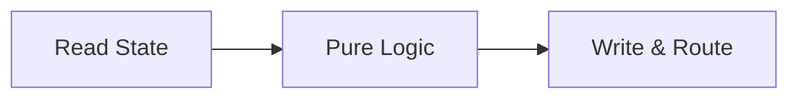

# Pocket

[](https://pkg.go.dev/github.com/agentstation/pocket)
[](https://goreportcard.com/report/github.com/agentstation/pocket)
[](https://github.com/agentstation/pocket/actions)
[](https://codecov.io/gh/agentstation/pocket)
[](https://opensource.org/licenses/MIT)
[](https://github.com/agentstation/pocket)

A minimalist LLM decision graph framework for Go. Build composable workflows with powerful decision graphs, type safety, and clean separation of concerns.

**Key Features:**
- 🎯 **Decision graphs** - Dynamic routing based on runtime logic
- 🔒 **Type safety** - Optional compile-time type checking with generics
- 🚀 **Built-in concurrency** - Native Go goroutines and patterns
- 📦 **Zero dependencies** - Pure Go standard library
- 🔧 **Interface-based** - Extensible architecture, graphs as nodes
- 🛡️ **Production ready** - Error handling, retries, observability

## 📚 Documentation

- **[Getting Started Guide](docs/guides/GETTING_STARTED.md)** - Your first Pocket workflow
- **[Full Documentation](docs/README.md)** - Complete guide with examples and patterns
- **[API Reference](https://pkg.go.dev/github.com/agentstation/pocket)** - Detailed API documentation

## Installation

```bash
go get github.com/agentstation/pocket
```

## Quick Start

```go
package main

import (
    "context"
    "fmt"
    "github.com/agentstation/pocket"
)

func main() {
    // Create a simple greeting node
    greet := pocket.NewNode[string, string]("greet",
        pocket.WithExec(func(ctx context.Context, name string) (string, error) {
            return fmt.Sprintf("Hello, %s!", name), nil
        }),
    )
    
    // Run it
    store := pocket.NewStore()
    graph := pocket.NewGraph(greet, store)
    
    result, _ := graph.Run(context.Background(), "World")
    fmt.Println(result) // "Hello, World!"
}
```

Want more? Check out the [Getting Started Guide](docs/guides/GETTING_STARTED.md) for a complete walkthrough.

## Core Concepts

### The Prep/Exec/Post Pattern

Every Pocket node follows a three-phase lifecycle:



- **Prep**: Read-only state access, input validation
- **Exec**: Pure business logic, no side effects
- **Post**: Write state, determine next node

[Learn more about the Prep/Exec/Post pattern →](docs/concepts/PREP_EXEC_POST.md)

### Type Safety

Pocket provides three levels of type safety:

1. **Compile-time** with Go generics
2. **Initialization-time** with graph validation
3. **Runtime** type checking

```go
// Compile-time safety
node := pocket.NewNode[User, Response]("process",
    pocket.WithExec(func(ctx context.Context, user User) (Response, error) {
        return processUser(user), nil
    }),
)

// Validate your entire graph
if err := pocket.ValidateGraph(startNode); err != nil {
    log.Fatal(err) // Type mismatch detected!
}
```

[Deep dive into type safety →](docs/guides/TYPE_SAFETY.md)

### Building Workflows

Connect nodes to create complex workflows:

```go
// Create nodes
validate := pocket.NewNode[User, ValidationResult]("validate", ...)
process := pocket.NewNode[ValidationResult, ProcessedUser]("process", ...)
notify := pocket.NewNode[ProcessedUser, NotifyResult]("notify", ...)

// Connect them
validate.Connect("valid", process)
validate.Connect("invalid", errorHandler)
process.Connect("success", notify)

// Build and run
graph := pocket.NewGraph(validate, store)
result, err := graph.Run(ctx, user)
```

[Explore workflow patterns →](docs/patterns/WORKFLOW_PATTERNS.md)

## Features

### 🧩 Composable Architecture

- **Node as Interface**: Graphs implement the Node interface, enabling natural composition
- **Graph as Node**: Nest workflows within workflows seamlessly
- **Custom Nodes**: Implement your own node types

[Learn about the architecture →](docs/concepts/ARCHITECTURE.md)

### 🔄 State Management

- **Bounded Store**: Built-in LRU eviction and TTL support
- **Thread-Safe**: Concurrent access handled automatically
- **Scoped Stores**: Isolate state by workflow or component

[State management guide →](docs/guides/STATE_MANAGEMENT.md)

### ⚡ Concurrency Patterns

Built-in patterns for parallel processing:

```go
// Fan-out: Process items in parallel
results, err := pocket.FanOut(ctx, processor, store, items)

// Pipeline: Chain operations
result, err := pocket.Pipeline(ctx, nodes, store, input)
```

[Explore concurrency patterns →](docs/patterns/CONCURRENCY.md)

### 🛡️ Error Handling & Resilience

- **Retries**: Configurable retry with backoff
- **Fallbacks**: Graceful degradation
- **Circuit Breakers**: Protect external services
- **Timeouts**: Prevent hanging operations

[Error handling guide →](docs/guides/ERROR_HANDLING.md)
## Examples

### Basic Workflow

```go
// Create nodes
validate := pocket.NewNode[Order, ValidationResult]("validate",
    pocket.WithExec(validateOrder),
)

process := pocket.NewNode[ValidationResult, ProcessedOrder]("process",
    pocket.WithExec(processOrder),
)

notify := pocket.NewNode[ProcessedOrder, NotifyResult]("notify",
    pocket.WithExec(sendNotification),
)

// Connect workflow
validate.Connect("valid", process)
validate.Connect("invalid", handleError)
process.Connect("success", notify)

// Run
graph := pocket.NewGraph(validate, pocket.NewStore())
result, err := graph.Run(ctx, order)
```

### Agent Pattern

```go
// Think-Act loop
think := pocket.NewNode[Context, Decision]("think",
    pocket.WithExec(analyzeContext),
    pocket.WithPost(func(ctx context.Context, store pocket.StoreWriter,
        input Context, prep, decision any) (Decision, string, error) {
        
        d := decision.(Decision)
        store.Set(ctx, "lastDecision", d)
        return d, d.Action, nil // Route to action
    }),
)

// Connect actions
think.Connect("research", researchNode)
think.Connect("execute", executeNode)
think.Connect("plan", planNode)

// Actions loop back to think
researchNode.Connect("done", think)
executeNode.Connect("done", think)
planNode.Connect("done", think)
```

[More examples →](examples/)

## Patterns

- **[Agent Patterns](docs/patterns/AGENT_PATTERNS.md)** - Autonomous agents, think-act loops
- **[Workflow Patterns](docs/patterns/WORKFLOW_PATTERNS.md)** - Sagas, compensation, orchestration
- **[Concurrency Patterns](docs/patterns/CONCURRENCY.md)** - Fan-out/in, pipelines, batching
- **[Batch Processing](docs/patterns/BATCH_PROCESSING.md)** - Map-reduce, parallel processing

## Advanced Topics

- **[Middleware](docs/advanced/MIDDLEWARE.md)** - Logging, metrics, tracing
- **[YAML Integration](docs/advanced/YAML_INTEGRATION.md)** - Declarative workflows
- **[Custom Nodes](docs/advanced/CUSTOM_NODES.md)** - Extend the framework
- **[Performance](docs/advanced/PERFORMANCE.md)** - Optimization guide

## Testing

```bash
# Run all tests with race detection
go test -race ./...

# Run with coverage
go test -cover ./...

# Run benchmarks
go test -bench=. -benchmem ./...

# Generate coverage report
go test -coverprofile=coverage.out ./...
go tool cover -html=coverage.out
```

[Testing guide →](docs/guides/TESTING.md)

## Migration Guide

### From Other Frameworks

- **From Airflow/Temporal** - [Migration guide](docs/reference/MIGRATION.md)
- **From Previous Versions** - No changes needed! Full backward compatibility

### What's New

- Graphs implement Node interface (compose workflows naturally)
- Built-in bounded store with LRU and TTL
- Enhanced type safety with compile-time validation

[Full migration guide →](docs/reference/MIGRATION.md)

## Contributing

We welcome contributions! Pocket is built by the community, for the community.

1. Fork the repository
2. Create your feature branch (`git checkout -b feature/amazing`)
3. Write tests for your changes
4. Ensure all tests pass (`go test -race ./...`)
5. Commit your changes (`git commit -m 'Add amazing feature'`)
6. Push to the branch (`git push origin feature/amazing`)
7. Open a Pull Request

See [CONTRIBUTING.md](CONTRIBUTING.md) for detailed guidelines.

## Performance

Pocket is designed for production performance:

- Zero allocations in hot paths
- Minimal overhead for node execution
- Efficient concurrent patterns
- Comprehensive benchmarks

```bash
# Run benchmarks
go test -bench=. -benchmem ./...
```

## License

MIT - see [LICENSE](LICENSE) for details.

## Acknowledgments

- Inspired by minimalist workflow patterns
- Built for Go's production requirements
- Built with ❤️ by [AgentStation](https://agentstation.ai)