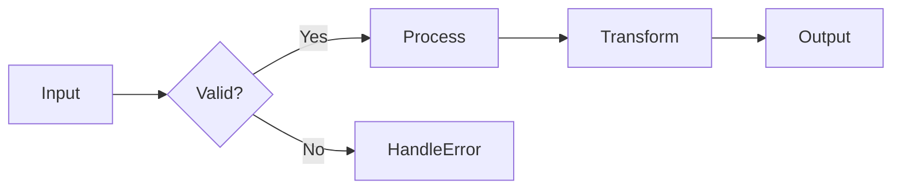
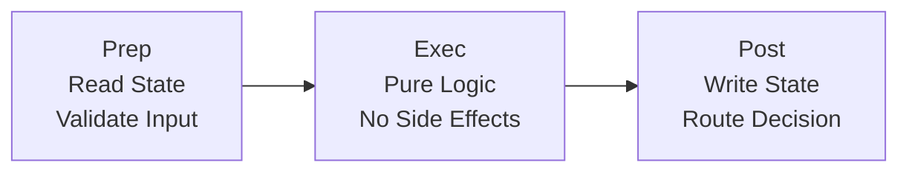

# Pocket - Graph Execution Engine for LLM Workflows

[](https://github.com/agentstation/pocket/actions)
[](https://opensource.org/licenses/MIT)
[](https://github.com/agentstation/pocket)
[](https://pkg.go.dev/github.com/agentstation/pocket)
[](https://goreportcard.com/report/github.com/agentstation/pocket)
[](https://codecov.io/gh/agentstation/pocket)

Pocket is a graph execution engine for building LLM workflows. Define your workflows in YAML, extend with plugins in any language, and run them with a simple CLI command - or embed the engine directly in your Go applications.

## What is Pocket?

Pocket is a **graph execution engine** that:
- 🎯 **Executes decision graphs** - Workflows are directed graphs with dynamic routing
- 🌐 **Language agnostic** - Define workflows in YAML/JSON, extend with plugins in any language
- 🔌 **Extensible** - 14 built-in nodes, Lua scripting, and WebAssembly plugin support
- 🚀 **Production ready** - Error handling, retries, timeouts, and observability built-in
- 📦 **Minimal dependencies** - Only essential Go dependencies for maximum reliability

## Quick Start

### Option 1: Using Pocket CLI (Recommended for Most Users)

Perfect for running workflows without writing code:

```bash
# Install Pocket CLI
go install github.com/agentstation/pocket/cmd/pocket@latest

# Create your first workflow
cat > hello.yaml << 'EOF'
name: hello-world
start: greet

nodes:
  - name: greet
    type: echo
    config:
      message: "Hello from Pocket!"
      
  - name: transform
    type: template
    config:
      template: "🚀 {{.message | upper}}"

connections:
  - from: greet
    to: transform
EOF

# Run it!
pocket run hello.yaml
```

**[→ Full CLI Documentation](docs/cli/)**

### Option 2: Using as a Go Library

For embedding the graph engine in your applications:

```go
package main

import (
    "context"
    "fmt"
    "github.com/agentstation/pocket"
)

func main() {
    // Create a simple greeting node
    greet := pocket.NewNode[string, string]("greet",
        pocket.WithExec(func(ctx context.Context, name string) (string, error) {
            return fmt.Sprintf("Hello, %s!", name), nil
        }),
    )
    
    // Run it
    store := pocket.NewStore()
    graph := pocket.NewGraph(greet, store)
    
    result, _ := graph.Run(context.Background(), "World")
    fmt.Println(result) // "Hello, World!"
}
```

**[→ Full Go Library Documentation](docs/library/)**

## 📚 Documentation

- **[CLI Documentation](docs/cli/)** - Command reference, YAML schemas, plugin management
- **[Library Documentation](docs/library/)** - Go API, embedding guide, type safety
- **[Full Documentation Hub](docs/README.md)** - All guides, patterns, and references

## Key Features

### 🎯 Graph Execution Engine

Pocket executes workflows as directed graphs where:
- **Nodes** perform operations (transform data, make API calls, etc.)
- **Edges** route data between nodes based on outputs
- **Decisions** happen dynamically at runtime



### 🔌 Extensible Node System

**14 Built-in Nodes:**
- **Core**: echo, delay, router, conditional
- **Data**: transform, template, jsonpath, validate, aggregate  
- **I/O**: http, file, exec
- **Flow**: parallel
- **Script**: lua

**Plugin Support:**
- **Lua Scripts** - Write custom logic in sandboxed Lua
- **WebAssembly** - Create plugins in TypeScript, Rust, Go, or any WASM-compatible language

### 🏗️ The Prep→Exec→Post Pattern

Every node follows a three-phase lifecycle:



This pattern ensures:
- **Clear separation of concerns**
- **Predictable execution**
- **Easy testing and debugging**
- **Natural error boundaries**

## CLI Usage

### Running Workflows

```bash
# Run a workflow
pocket run workflow.yaml

# With verbose output
pocket run workflow.yaml --verbose

# Validate without executing
pocket run workflow.yaml --dry-run
```

### Managing Nodes and Plugins

```bash
# List available nodes
pocket nodes list

# Get node details
pocket nodes info http

# Install a plugin
pocket plugins install ./sentiment-analyzer

# List installed plugins
pocket plugins list
```

### Example Workflow

```yaml
name: api-processor
start: fetch-data

nodes:
  - name: fetch-data
    type: http
    config:
      url: "https://api.example.com/data"
      
  - name: validate
    type: validate
    config:
      schema:
        type: object
        required: [status, data]
        
  - name: transform
    type: transform
    config:
      jq: ".data | map({id, value: .price * 1.1})"

connections:
  - from: fetch-data
    to: validate
  - from: validate
    to: transform
    action: valid
  - from: validate
    to: error-handler
    action: invalid
```

**[→ More Workflow Examples](docs/workflows/)**

## Library Usage

### Building Workflows in Go

```go
// Create nodes with type safety
validate := pocket.NewNode[Order, ValidationResult]("validate",
    pocket.WithExec(validateOrder),
)

process := pocket.NewNode[ValidationResult, ProcessedOrder]("process",
    pocket.WithExec(processOrder),
)

notify := pocket.NewNode[ProcessedOrder, NotifyResult]("notify",
    pocket.WithExec(sendNotification),
)

// Connect workflow
validate.Connect("valid", process)
validate.Connect("invalid", handleError)
process.Connect("success", notify)

// Run
graph := pocket.NewGraph(validate, pocket.NewStore())
result, err := graph.Run(ctx, order)
```

### Advanced Patterns

**Agent Pattern (Think-Act Loop):**
```go
think := pocket.NewNode[Context, Decision]("think",
    pocket.WithExec(analyzeContext),
    pocket.WithPost(func(ctx context.Context, store pocket.StoreWriter,
        input Context, prep, decision any) (Decision, string, error) {
        
        d := decision.(Decision)
        store.Set(ctx, "lastDecision", d)
        return d, d.Action, nil // Route to action
    }),
)

// Actions loop back to think
think.Connect("research", researchNode)
think.Connect("execute", executeNode)
think.Connect("plan", planNode)
```

**[→ More Patterns](docs/patterns/)**

## Creating Plugins

### Lua Script Example

```lua
-- ~/.pocket/scripts/sentiment.lua
-- @name: sentiment-analyzer
-- @description: Analyze text sentiment

function exec(input)
    local text = input.text or ""
    local positive_words = {"good", "great", "excellent", "amazing"}
    local negative_words = {"bad", "poor", "terrible", "awful"}
    
    local score = 0
    for _, word in ipairs(positive_words) do
        if string.find(text:lower(), word) then
            score = score + 1
        end
    end
    
    for _, word in ipairs(negative_words) do
        if string.find(text:lower(), word) then
            score = score - 1
        end
    end
    
    return {
        sentiment = score > 0 and "positive" or score < 0 and "negative" or "neutral",
        score = score
    }
end
```

### WebAssembly Plugin Example

```typescript
// TypeScript plugin using Pocket SDK
import { PocketPlugin, NodeBuilder } from '@pocket/sdk';

export default class SentimentAnalyzer extends PocketPlugin {
  createNodes(): NodeBuilder[] {
    return [
      this.createNode('sentiment')
        .withExec(async (input: any) => {
          const text = input.text || '';
          // Sentiment analysis logic
          return { sentiment: 'positive', confidence: 0.95 };
        })
        .build()
    ];
  }
}
```

**[→ Plugin Development Guide](docs/development/plugin-development.md)**

## Installation Options

### CLI Binary (Recommended)

```bash
# Via go install
go install github.com/agentstation/pocket/cmd/pocket@latest

# Or download pre-built binaries (coming soon)
# curl -L https://github.com/agentstation/pocket/releases/latest/download/pocket-$(uname -s)-$(uname -m) -o pocket
# chmod +x pocket
# sudo mv pocket /usr/local/bin/
```

### Go Library

```bash
go get github.com/agentstation/pocket
```

### From Source

```bash
git clone https://github.com/agentstation/pocket.git
cd pocket
make build
```

## Examples

The `examples/` directory contains:

- **[CLI Workflows](examples/cli/)** - YAML workflow examples
- **[Go Examples](examples/)** - Library usage patterns
- **[Plugin Examples](plugins/examples/)** - Custom plugin implementations

## Contributing

We welcome contributions! Pocket is built by the community, for the community.

1. Fork the repository
2. Create your feature branch (`git checkout -b feature/amazing`)
3. Write tests for your changes
4. Ensure all tests pass (`go test -race ./...`)
5. Commit your changes (`git commit -m 'Add amazing feature'`)
6. Push to the branch (`git push origin feature/amazing`)
7. Open a Pull Request

See [CONTRIBUTING.md](docs/CONTRIBUTING.md) for detailed guidelines.

## Testing

```bash
# Run all tests with race detection
go test -race ./...

# Run with coverage
go test -cover ./...

# Run benchmarks
go test -bench=. -benchmem ./...

# Generate coverage report
go test -coverprofile=coverage.out ./...
go tool cover -html=coverage.out
```

## Performance

Pocket is designed for production performance:

- Zero allocations in hot paths
- Minimal overhead for node execution
- Efficient concurrent patterns
- Comprehensive benchmarks

## License

MIT - see [LICENSE](LICENSE) for details.

## Acknowledgments

- Inspired by workflow automation patterns
- Built for production Go applications
- Designed for LLM-directed workflows
- Built with ❤️ by [AgentStation](https://agentstation.ai)