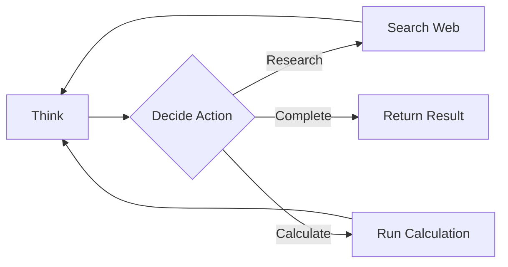

# Pocket

[](https://github.com/agentstation/pocket/actions)
[](https://opensource.org/licenses/MIT)

Pocket is a CLI tool for executing LLM workflows defined as graphs. Write your workflows in YAML, extend with plugins in any language, and run them with a simple command.

## What is Pocket?

Pocket executes workflows as directed graphs, where nodes make decisions and route data dynamically - perfect for LLM agents that need to think, act, and adapt based on their outputs.



## Installation

### Quick Install (Recommended)

```bash
# macOS and Linux via Homebrew (pre-built binary)
brew install agentstation/tap/pocket

# Or use our install script
curl -sSL https://raw.githubusercontent.com/agentstation/pocket/master/install.sh | bash
```

### Other Installation Methods

<details>
<summary>Build from Source via Homebrew</summary>

```bash
# Compile locally instead of using pre-built binary
brew install --build-from-source agentstation/tap/pocket
```
</details>

<details>
<summary>Install via Go</summary>

```bash
go install github.com/agentstation/pocket/cmd/pocket@latest
```
</details>

<details>
<summary>Download Pre-built Binaries</summary>

Download the latest release for your platform from the [releases page](https://github.com/agentstation/pocket/releases/latest).

```bash
# Example for Linux x64
curl -L https://github.com/agentstation/pocket/releases/latest/download/pocket-linux-x86_64.tar.gz -o pocket.tar.gz
tar -xzf pocket.tar.gz
sudo mv pocket-linux-x86_64/pocket /usr/local/bin/
```

Available platforms:
- macOS: `pocket-darwin-x86_64.tar.gz` (Intel), `pocket-darwin-arm64.tar.gz` (Apple Silicon)
- Linux: `pocket-linux-x86_64.tar.gz`, `pocket-linux-arm64.tar.gz`, `pocket-linux-i386.tar.gz`
- Windows: `pocket-windows-x86_64.zip`, `pocket-windows-i386.zip`
</details>

<details>
<summary>Verify Installation</summary>

```bash
# Check version
pocket version

# Verify checksums (optional)
curl -L https://github.com/agentstation/pocket/releases/latest/download/checksums.txt -o checksums.txt
sha256sum -c checksums.txt
```
</details>

## Quick Start

Create a workflow that thinks and acts:

```yaml
# agent.yaml
name: simple-agent
start: think

nodes:
  - name: think
    type: http
    config:
      url: "https://api.openai.com/v1/chat/completions"
      method: POST
      headers:
        Authorization: "Bearer ${OPENAI_API_KEY}"
      body:
        model: "gpt-4"
        messages:
          - role: "system"
            content: "You are a helpful assistant. Respond with either SEARCH: <query> or ANSWER: <response>"
          - role: "user"
            content: "{{.question}}"
            
  - name: route
    type: conditional
    config:
      conditions:
        - if: '{{contains .choices[0].message.content "SEARCH:"}}'
          then: search
        - if: '{{contains .choices[0].message.content "ANSWER:"}}'
          then: respond
          
  - name: search
    type: http
    config:
      url: "https://api.search.com/v1/search"
      params:
        q: '{{.query}}'
        
  - name: respond
    type: echo
    config:
      message: '{{.answer}}'

connections:
  - from: think
    to: route
  - from: search
    to: think  # Loop back with search results
```

Run it:

```bash
pocket run agent.yaml --input '{"question": "What is the weather in Tokyo?"}'
```

## Why Pocket?

### 🌐 Language Agnostic

Write workflows in YAML, extend with plugins in **any language**:
- **Lua** - Quick scripts for custom logic
- **WebAssembly** - Compile from Rust, Go, TypeScript, or any WASM-compatible language
- **Native Go** - High-performance plugins

### 🧠 Dynamic Routing

Unlike linear pipelines, Pocket workflows make decisions:
- Conditional branching based on data
- Loops for agent think-act cycles  
- Parallel execution for efficiency
- Error handling with fallback paths

### 🚀 Production Ready

Built for real-world use:
- Automatic retries with exponential backoff
- Timeouts and cancellation
- Comprehensive error handling
- Observable with metrics and tracing

### 📦 Zero Dependencies

Just a single binary. No runtime required.

## Key Features

### Build LLM Agents That Think and Act

Create agents that can reason, search, use tools, and make decisions:

```yaml
nodes:
  - name: agent-brain
    type: lua
    config:
      script: |
        -- Analyze the task and decide what to do
        local task = input.task
        if string.find(task, "calculate") then
          return {action = "calculator", expression = task}
        elseif string.find(task, "search") then
          return {action = "web_search", query = task}
        else
          return {action = "direct_answer", task = task}
        end
```

### Write Plugins in Any Language

**Lua Script Plugin:**
```lua
-- sentiment.lua
function exec(input)
    local text = input.text:lower()
    local positive = {"good", "great", "excellent", "love"}
    local negative = {"bad", "terrible", "hate", "awful"}
    
    local score = 0
    for _, word in ipairs(positive) do
        if string.find(text, word) then score = score + 1 end
    end
    for _, word in ipairs(negative) do
        if string.find(text, word) then score = score - 1 end
    end
    
    return {
        sentiment = score > 0 and "positive" or score < 0 and "negative" or "neutral",
        score = score
    }
end
```

**WebAssembly Plugin (TypeScript):**
```typescript
export function analyzeImage(input: ImageData): Analysis {
    // Your image processing logic compiled to WASM
    return { objects: detected, confidence: 0.95 };
}
```

### Define Complex Workflows in Simple YAML

Pocket's YAML format is designed for clarity:

```yaml
name: data-pipeline
start: fetch

nodes:
  - name: fetch
    type: parallel  # Fetch from multiple sources concurrently
    config:
      tasks:
        - {type: http, config: {url: "${API1}"}}
        - {type: http, config: {url: "${API2}"}}
        
  - name: merge
    type: aggregate
    config:
      mode: combine
      
  - name: validate
    type: validate
    config:
      schema:
        type: object
        required: [id, data]
```

### Production Features Built-In

- **Retries**: `retry: {max_attempts: 3, delay: "2s"}`
- **Timeouts**: `timeout: "30s"`
- **Caching**: Built-in store with TTL
- **Observability**: Metrics, traces, and structured logs

## 📚 Documentation

- **[Getting Started Guide](docs/cli/getting-started.md)** - Build your first workflow
- **[Workflow Examples](docs/workflows/)** - Real-world patterns and use cases
- **[Plugin Development](docs/cli/plugins.md)** - Extend Pocket with custom nodes
- **[Full Documentation](docs/README.md)** - All guides and references

## Examples

### LLM Agent with Tools

```yaml
name: research-agent
start: think

nodes:
  - name: think
    type: llm  # Uses OpenAI, Anthropic, or local models
    config:
      prompt: |
        You have access to: calculator, web_search, file_reader
        User query: {{.query}}
        Respond with the tool to use and parameters.
        
  - name: use-tool
    type: router
    config:
      routes:
        calculator: calc-node
        web_search: search-node
        file_reader: read-node
```

### Data Processing Pipeline

```yaml
name: etl-pipeline
start: extract

nodes:
  - name: extract
    type: file
    config:
      path: "data/*.json"
      
  - name: transform
    type: transform
    config:
      jq: 'map(select(.active) | {id, name, value: .price * 1.1})'
      
  - name: load
    type: http
    config:
      url: "${WAREHOUSE_API}"
      method: POST
```

[→ More Examples](docs/workflows/)

## Plugins

Extend Pocket with plugins:

```bash
# Install a plugin
pocket plugin install github.com/example/pocket-redis

# Use in your workflow
nodes:
  - name: cache-result
    type: redis-set  # From the plugin
    config:
      key: "result:{{.id}}"
      value: "{{.data}}"
```

## Contributing

We welcome contributions! See [CONTRIBUTING.md](docs/CONTRIBUTING.md) for guidelines.

```bash
# Run tests
go test -race ./...

# Build
make build

# Run benchmarks
make bench
```

## Using as a Go Library

While Pocket is designed as a CLI tool, it can also be embedded in Go applications:

```go
package main

import (
    "context"
    "github.com/agentstation/pocket"
)

func main() {
    // Create nodes
    process := pocket.NewNode[Input, Output]("process",
        pocket.Steps{
            Exec: func(ctx context.Context, input any) (any, error) {
                // Your logic here
                return processData(input.(Input))
            },
        },
    )
    
    // Build and run workflow
    graph := pocket.NewGraph(process, pocket.NewStore())
    result, _ := graph.Run(context.Background(), myInput)
}
```

[→ Go Library Documentation](docs/library/)

## Development

### Prerequisites

- Go 1.21+
- Make (optional)

### Building from Source

```bash
git clone https://github.com/agentstation/pocket.git
cd pocket
go build -o pocket cmd/pocket/main.go
```

### Architecture

Pocket uses a three-phase execution model:

1. **Prep** - Validate input and prepare data
2. **Exec** - Execute core logic (pure functions)
3. **Post** - Handle results and routing decisions

This ensures predictable execution and easy testing.

### Go-Specific Information

[](https://pkg.go.dev/github.com/agentstation/pocket)
[](https://goreportcard.com/report/github.com/agentstation/pocket)
[](https://codecov.io/gh/agentstation/pocket)

## License

MIT - see [LICENSE](LICENSE) for details.

## Acknowledgments

Built with ❤️ by [AgentStation](https://agentstation.ai) for the LLM agent community.