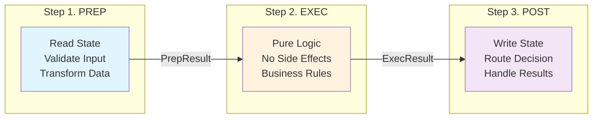
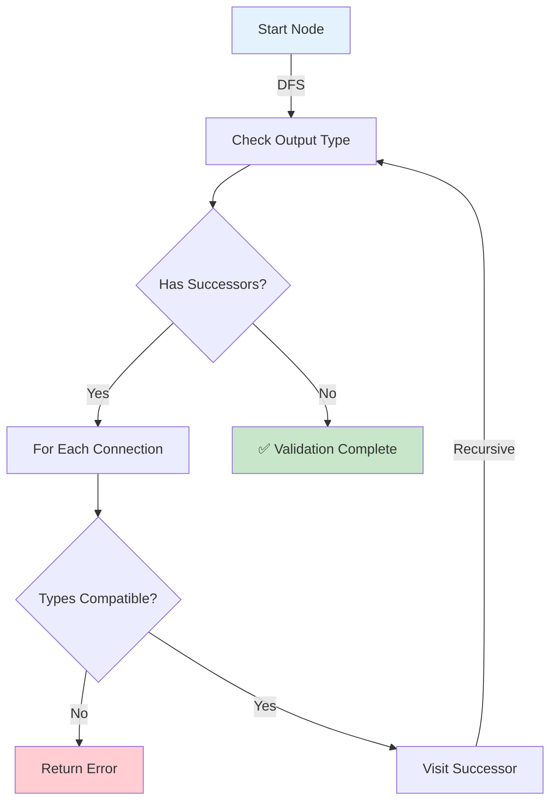
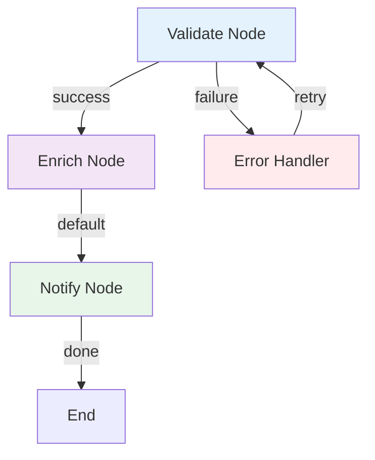
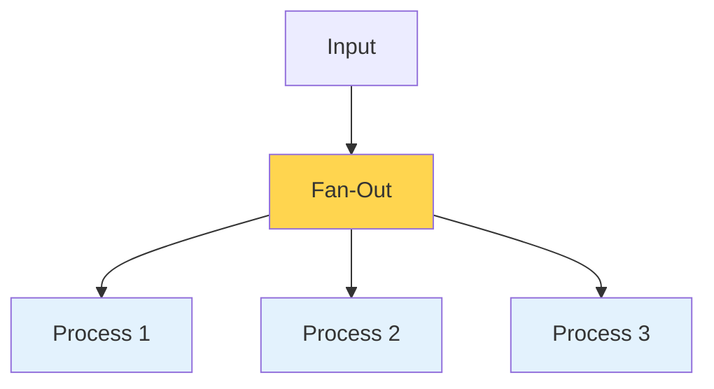
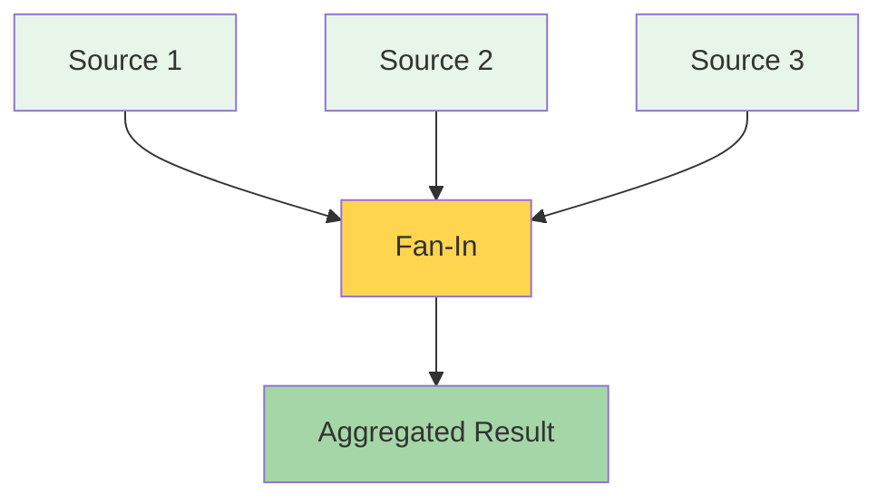
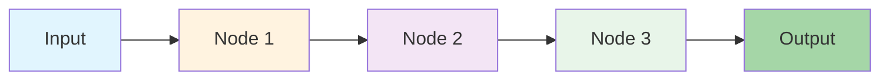
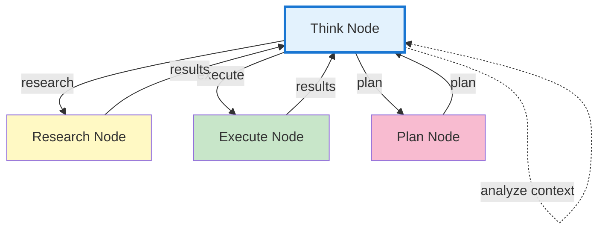
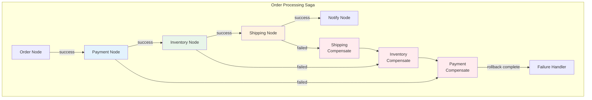
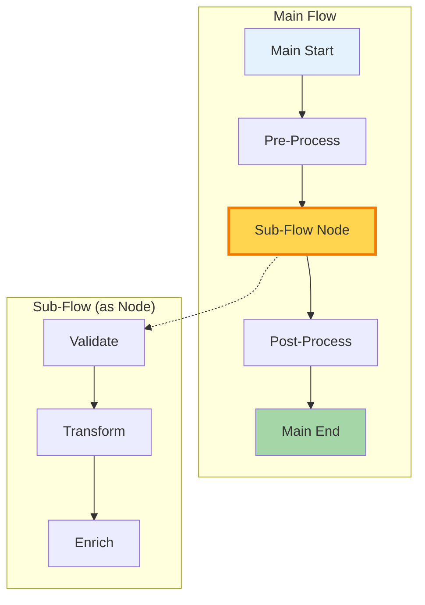
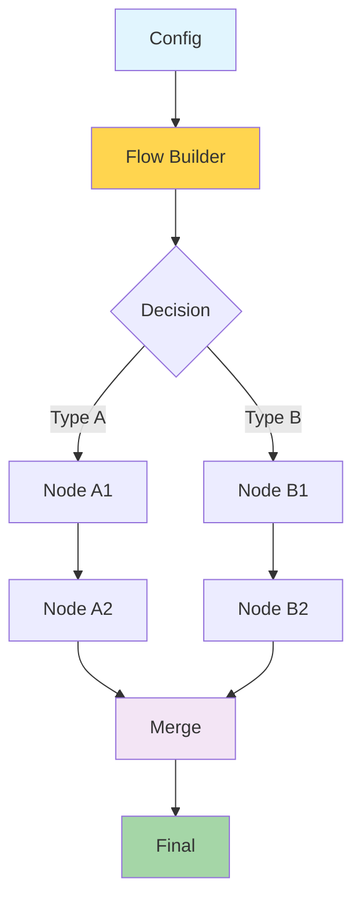

# Pocket

[](https://pkg.go.dev/github.com/agentstation/pocket)
[](https://goreportcard.com/report/github.com/agentstation/pocket)
[](https://github.com/agentstation/pocket/actions)
[](https://codecov.io/gh/agentstation/pocket)
[](https://opensource.org/licenses/MIT)
[](https://github.com/agentstation/pocket)

A simple LLM decision graph package, written in golang, and inspired by [PocketFlow](https://github.com/The-Pocket/PocketFlow)'s Prep/Exec/Post workflow pattern. Avoid large LLM framework lock-in.

Build composable LLM workflows via directed graphs with:
- powerful decision graph flexiblity
- robust resilancy
    - configurable retrys
    - fallback support
- buisness logic orchistration
    - node steps (prep, exec, post)
    - hooks
    - tracability & observability
    - layered graph composability
- go type safety w/ generics
- built-in concurrency via goroutines
- limited dependencies
    - SYNC support: golang.org/x/sync
    - YAML support: https://github.com/goccy/go-yaml

## Table of Contents
- [Why Pocket?](#why-pocket)
- [Quick Start](#quick-start)
- [Core Concepts](#core-concepts)
  - [The Prep/Exec/Post Lifecycle](#the-prepexecpost-lifecycle)
  - [Read/Write Separation](#readwrite-separation)
  - [Type Safety](#type-safety)
- [Building Workflows](#building-workflows)
  - [Creating Nodes](#creating-nodes)
  - [Connecting Nodes](#connecting-nodes)
  - [State Management](#state-management)
- [Concurrency & Performance](#concurrency--performance)
  - [Built-in Patterns](#built-in-patterns)
  - [Batch Processing](#batch-processing)
- [Production Features](#production-features)
  - [Error Handling](#error-handling)
  - [Observability](#observability)
  - [Testing](#testing)
- [Patterns & Examples](#patterns--examples)
  - [Agent Patterns](#agent-patterns)
  - [Workflow Patterns](#workflow-patterns)
  - [Advanced Patterns](#advanced-patterns)
- [Migration Guide](#migration-guide)
- [API Reference](#api-reference)
- [Contributing](#contributing)

## Why Pocket?

Pocket is a decision graph framework that lets you build complex workflows as connected nodes. At its core, it's a way to traverse directed graphs where each node makes decisions about what happens next.

### What Makes Pocket Special?

1. **Decision Graph Architecture**
   - Build workflows as directed graphs
   - Each node decides the next step dynamically
   - Non-deterministic transitions based on runtime logic
   - Clear execution flow visualization

2. **Enforced Read/Write Separation** 
   - Prep step: Read-only access
   - Exec step: Pure functions, no store
   - Post step: Full read/write access

3. **Go's Strengths**
   - Optional compile-time type safety
   - Built-in concurrency primitives
   - Production-grade performance

4. **Zero Dependencies**
   - Pure Go standard library
   - No vendor lock-in
   - Easy to understand and modify

## Quick Start

```bash
go get github.com/agentstation/pocket
```

Your first Pocket workflow in 30 seconds:

```go
package main

import (
    "context"
    "fmt"
    "github.com/agentstation/pocket"
)

func main() {
    // Create a simple greeting node
    greet := pocket.NewNode[string, string]("greet",
        pocket.WithExec(func(ctx context.Context, name string) (string, error) {
            return fmt.Sprintf("Hello, %s!", name), nil
        }),
    )
    
    // Run it
    store := pocket.NewStore()
    flow := pocket.NewFlow(greet, store)
    
    result, _ := flow.Run(context.Background(), "World")
    fmt.Println(result) // "Hello, World!"
}
```

## Core Concepts

### The Prep/Exec/Post Lifecycle

Every Pocket node follows three phases:



```go
node := pocket.NewNode[any, any]("example",
    pocket.WithPrep(func(ctx context.Context, store pocket.StoreReader, input any) (any, error) {
        // Prepare data, validate input, read state
        // store is read-only - can only Get, not Set
        existingData, _ := store.Get(ctx, "key")
        return preparedData, nil
    }),
    pocket.WithExec(func(ctx context.Context, prepData any) (any, error) {
        // Pure business logic - no side effects
        // No store access enforces functional purity
        return processData(prepData), nil
    }),
    pocket.WithPost(func(ctx context.Context, store pocket.StoreWriter, input, prepData, result any) (any, string, error) {
        // Process results, save state, determine next node
        // store has full read/write access
        store.Set(ctx, "result", result)
        return output, "nextNode", nil
    }),
)
```

### Read/Write Separation

This separation ensures:
- **Prep step** can read configuration and state but cannot modify it
- **Exec step** contains pure, testable business logic with no side effects
- **Post step** handles all state mutations and persistence

Benefits of this architecture:
- **Testability**: Exec functions are pure and easy to unit test
- **Predictability**: State changes only happen in designated steps
- **Concurrency Safety**: Read-only steps can safely run in parallel
- **Debugging**: Clear boundaries make it easy to trace state changes
- **Reusability**: Pure exec functions can be composed and reused

### Type Safety

Pocket provides a three-tier type safety system to catch errors as early as possible:

#### 1. Compile-Time Safety (Generics)

Use Go's generics for the strongest type guarantees:

```go
// Fully typed nodes - errors caught at compile time
userNode := pocket.NewNode[User, Response]("process",
    pocket.WithExec(func(ctx context.Context, user User) (Response, error) {
        // user is typed as User, no casting needed
        return processUser(user), nil
    }),
)

// Type-safe option functions
validator := pocket.NewNode[User, ValidationResult]("validate",
    pocket.WithPrep(func(ctx context.Context, store pocket.StoreReader, user User) (UserData, error) {
        // Input is compile-time typed as User
        return prepareUserData(user), nil
    }),
    pocket.WithExec(func(ctx context.Context, data UserData) (ValidationResult, error) {
        // data is compile-time typed as UserData
        return validateUserData(data), nil
    }),
    pocket.WithPost(func(ctx context.Context, store pocket.StoreWriter, user User, prep UserData, result ValidationResult) (ValidationResult, string, error) {
        // All parameters are compile-time typed
        store.Set(ctx, "validation:"+user.ID, result)
        return result, result.NextStep, nil
    }),
)
```

#### 2. Initialization-Time Safety (ValidateFlow)

Validate type compatibility across your entire workflow graph before execution:

```go
// Connect nodes
userProcessor := pocket.NewNode[User, ProcessedUser]("process", ...)
emailSender := pocket.NewNode[ProcessedUser, EmailResult]("email", ...)
wrongNode := pocket.NewNode[DifferentType, any]("wrong", ...)

userProcessor.Connect("success", emailSender)    // ✅ Types match
userProcessor.Connect("failure", wrongNode)       // ❌ Type mismatch

// Validate the entire graph before running
if err := pocket.ValidateFlow(userProcessor); err != nil {
    // Error: "type mismatch at connection 'process'->'wrong': 
    //         node 'process' outputs ProcessedUser but node 'wrong' expects DifferentType"
    log.Fatal(err)
}

// ValidateFlow checks:
// - Exact type matches
// - Interface satisfaction
// - Type assignability
// - Handles 'any' types appropriately
```

#### 3. Runtime Safety

Even with dynamic types, Pocket validates at runtime:

```go
// Dynamic node for flexibility
flexNode := pocket.NewNode[any, any]("flexible",
    pocket.WithExec(func(ctx context.Context, input any) (any, error) {
        // Runtime type checking
        switch v := input.(type) {
        case User:
            return processUser(v), nil
        case string:
            return processString(v), nil
        default:
            return nil, fmt.Errorf("unsupported type: %T", input)
        }
    }),
)

// Runtime validation when executing
flow := pocket.NewFlow(flexNode, store)
_, err := flow.Run(ctx, "string input")  // ✅ Works
_, err = flow.Run(ctx, 123)              // ❌ Returns error: "unsupported type: int"
```

#### Mixed Type Safety

Combine typed and untyped nodes for maximum flexibility:

```go
// Typed validator
validator := pocket.NewNode[User, ValidationResult]("validator",
    pocket.WithExec(validateUser),
)

// Untyped logger (works with any type)
logger := pocket.NewNode[any, any]("logger",
    pocket.WithExec(func(ctx context.Context, input any) (any, error) {
        log.Printf("Processing: %+v", input)
        return input, nil
    }),
)

// Connect them - ValidateFlow handles mixed scenarios
validator.Connect("default", logger)  // ✅ any accepts ValidationResult
```

#### Type-Safe Storage

Use the generic store wrapper for type-safe state management:

```go
// Create a type-safe store
userStore := pocket.NewTypedStore[User](store)

// Compile-time type safety
err := userStore.Set(ctx, "user:123", user)           // ✅ Correct type
err = userStore.Set(ctx, "user:456", "not a user")    // ❌ Compile error

// Retrieved value is typed
user, exists, err := userStore.Get(ctx, "user:123")   // user is User, not any
```

#### How ValidateFlow Works Internally

ValidateFlow performs a depth-first search traversal of your workflow graph:



**Technical Details:**
- Uses a `visited` map to prevent infinite loops in cyclic graphs
- Skips validation for nodes without type information (`any` types)
- Checks type compatibility using reflection:
  ```go
  func isTypeCompatible(outputType, inputType reflect.Type) bool {
      // 1. Exact type match
      if outputType == inputType {
          return true
      }
      // 2. Interface satisfaction
      if inputType.Kind() == reflect.Interface {
          return outputType.Implements(inputType)
      }
      // 3. Type assignability
      return outputType.AssignableTo(inputType)
  }
  ```

#### Error Messages at Each Stage

**1. Compile-Time Errors**

When types don't match generic parameters:
```go
// This won't compile:
node := pocket.NewNode[User, Response]("process",
    pocket.WithExec(func(ctx context.Context, input WrongType) (Response, error) {
        // Compiler error:
        // cannot use func literal (type func(context.Context, WrongType) (Response, error)) 
        // as type func(context.Context, User) (Response, error) in argument to pocket.WithExec
        return Response{}, nil
    }),
)
```

**2. Initialization-Time Errors (ValidateFlow)**

When connected nodes have incompatible types:
```go
err := pocket.ValidateFlow(startNode)
// Error: "type mismatch: node "process" outputs *main.ProcessedUser but node "wrongHandler" expects *main.DifferentType (via action "success")"
```

The error includes:
- Source node name and output type
- Target node name and expected input type
- The connection action/route that links them

**3. Runtime Type Errors**

When actual data doesn't match expected types:
```go
// From WithExec type assertion:
// Error: "invalid input: exec expected *main.User, got string"

// From runtime validation in executeNode:
// Error: "invalid input: node "validator" expects *main.User but got *main.Product"

// From WithPost type assertion:
// Error: "invalid input: post expected exec result *main.ValidationResult, got *main.UnexpectedType"
```

#### Success Confirmation

When validation passes, you'll know your graph is type-safe:

```go
fmt.Println("Validating flow types...")
if err := pocket.ValidateFlow(startNode); err != nil {
    log.Fatalf("Flow validation failed: %v", err)
}
fmt.Println("✅ Flow validation passed!")
// Your workflow graph is type-safe and ready to run
```

ValidateFlow returns `nil` when:
- All connected nodes have compatible types
- Interface implementations are satisfied
- No type mismatches are found in the entire graph

#### Special Type Handling

**Nil Input Handling:**
```go
// WithExec handles nil by using zero values
if input == nil {
    result, err := fn(ctx, *new(In))  // Zero value of type In
}
```

**Interface{} (any) Types:**
- Nodes with `any` input accept any output type
- Nodes with `any` output can connect to any input type
- ValidateFlow skips type checking when `any` is involved

**Type Priority:**
1. Exact type match (fastest)
2. Interface satisfaction check
3. Type assignability check
4. Special `any` type handling

#### Best Practices

1. **Use generics by default** - Get compile-time safety whenever possible
2. **Always run ValidateFlow** - Catch connection mismatches before runtime
3. **Use `any` sparingly** - Only for truly dynamic scenarios
4. **Leverage type-safe wrappers** - Use TypedStore for state management
5. **Handle type assertions** - Always check error returns from type assertions
6. **Log validation success** - Confirm your graph is type-safe before deployment

## Building Workflows

### Creating Nodes

Nodes are the building blocks of your workflows:

```go
// Simple node with just exec
simple := pocket.NewNode[string, string]("uppercase",
    pocket.WithExec(func(ctx context.Context, input string) (string, error) {
        return strings.ToUpper(input), nil
    }),
)

// Full lifecycle node
validator := pocket.NewNode[User, ValidationResult]("validate",
    pocket.WithPrep(func(ctx context.Context, store pocket.StoreReader, user User) (any, error) {
        // Read validation rules
        rules, _ := store.Get(ctx, "validation:rules")
        return map[string]any{"user": user, "rules": rules}, nil
    }),
    pocket.WithExec(func(ctx context.Context, data any) (ValidationResult, error) {
        // Apply validation logic
        d := data.(map[string]any)
        return validateUser(d["user"].(User), d["rules"]), nil
    }),
    pocket.WithPost(func(ctx context.Context, store pocket.StoreWriter, user User, prep any, result ValidationResult) (ValidationResult, string, error) {
        // Save result and route
        store.Set(ctx, "lastValidation", result)
        if result.Valid {
            return result, "success", nil
        }
        return result, "failure", nil
    }),
)
```

### Connecting Nodes

Build complex workflows by connecting nodes:



```go
// Direct connection
validate.Connect("success", enrich)
validate.Connect("failure", errorHandler)
enrich.Connect("default", notify)

// Using the builder pattern
flow, err := pocket.NewBuilder(store).
    Add(validate).
    Add(enrich).
    Add(notify).
    Add(errorHandler).
    Connect("validate", "success", "enrich").
    Connect("validate", "failure", "errorHandler").
    Connect("enrich", "default", "notify").
    Start("validate").
    Build()
```

### State Management

Thread-safe state management with context support:

```go
// Basic store operations
store := pocket.NewStore()
store.Set(ctx, "user:123", user)
value, exists := store.Get(ctx, "user:123")
store.Delete(ctx, "user:123")

// Scoped stores for isolation
userStore := store.Scope("user")
userStore.Set(ctx, "123", user) // Actually stores as "user:123"

// Type-safe store wrapper
typedStore := pocket.NewTypedStore[User](store)
err := typedStore.Set(ctx, "user:123", user)
retrieved, exists, err := typedStore.Get(ctx, "user:123")
// retrieved is typed as User, not any
```

## Concurrency & Performance

### Built-in Patterns

Pocket provides idiomatic Go concurrency patterns out of the box:

#### Fan-Out Pattern

Distribute work across multiple processors:



```go
// Fan-out - process items in parallel
items := []string{"item1", "item2", "item3"}
results, err := pocket.FanOut(ctx, processor, store, items)
```

#### Fan-In Pattern

Aggregate results from multiple sources:



```go
// Fan-in - aggregate from multiple sources
fanIn := pocket.NewFanIn(aggregator, source1, source2, source3)
result, err := fanIn.Run(ctx, store)
```

#### Pipeline Pattern

Chain operations where each output feeds the next input:



```go
// Pipeline - output feeds next input
result, err := pocket.Pipeline(ctx, nodes, store, input)

// Run nodes concurrently (general pattern)
results, err := pocket.RunConcurrent(ctx, nodes, store)
```

### Batch Processing

Type-safe batch operations with generics:

```go
import "github.com/agentstation/pocket/batch"

// Map-reduce pattern
processor := batch.MapReduce(
    extractItems,    // func(ctx, store) ([]T, error)
    transformItem,   // func(ctx, T) (R, error)  
    aggregateResults,// func(ctx, []R) (any, error)
    batch.WithConcurrency(10),
)

// Process each item
batch.ForEach(extractItems, processItem,
    batch.WithConcurrency(5),
)

// Filter items
filtered := batch.Filter(extractItems, predicate)
```

## Production Features

### Error Handling

Multiple strategies for resilient workflows:

```go
// Retry with exponential backoff
node := pocket.NewNode[any, any]("resilient",
    pocket.WithExec(processFunc),
    pocket.WithRetry(3, time.Second),
)

// Fallback on error
node := pocket.NewNode[any, any]("with-fallback",
    pocket.WithExec(mainFunc),
    pocket.WithFallback(func(ctx context.Context, input any, err error) (any, error) {
        // Fallback logic
        return defaultValue, nil
    }),
)

// Circuit breaker pattern
import "github.com/agentstation/pocket/internal/fallback"

cb := fallback.NewCircuitBreaker("external-api",
    fallback.WithMaxFailures(3),
    fallback.WithResetTimeout(30*time.Second),
)
```

### Observability

Built-in hooks for monitoring and debugging:

```go
// Lifecycle hooks
node := pocket.NewNode[any, any]("observable",
    pocket.WithExec(mainFunc),
    pocket.WithOnSuccess(func(ctx context.Context, store pocket.StoreWriter, output any) {
        // Log success metrics
        store.Set(ctx, "metrics:success", time.Now())
    }),
    pocket.WithOnFailure(func(ctx context.Context, store pocket.StoreWriter, err error) {
        // Log failure metrics
        store.Set(ctx, "metrics:failure", err.Error())
    }),
    pocket.WithOnComplete(func(ctx context.Context, store pocket.StoreWriter) {
        // Cleanup - always runs
        store.Delete(ctx, "temp:data")
    }),
)

// Flow-level logging and tracing
flow := pocket.NewFlow(start, store,
    pocket.WithLogger(logger),
    pocket.WithTracer(tracer),
)
```

### Testing

```bash
# Run all tests with race detection
go test -race ./...

# Run with coverage
go test -cover ./...

# Run benchmarks
go test -bench=. -benchmem ./...

# Generate coverage report
go test -coverprofile=coverage.out ./...
go tool cover -html=coverage.out
```

## Patterns & Examples

### Agent Patterns

Build autonomous agents with think-act loops:



```go
// Think node analyzes and decides
think := pocket.NewNode[any, any]("think",
    pocket.WithPrep(func(ctx context.Context, store pocket.StoreReader, input any) (any, error) {
        // Read current task and context
        task, _ := store.Get(ctx, "task")
        context, _ := store.Get(ctx, "context")
        return map[string]any{"task": task, "context": context}, nil
    }),
    pocket.WithExec(func(ctx context.Context, data any) (any, error) {
        // Pure decision logic - analyze task and decide action
        taskData := data.(map[string]any)
        if needsResearch(taskData["task"]) {
            return "research", nil
        }
        return "execute", nil
    }),
    pocket.WithPost(func(ctx context.Context, store pocket.StoreWriter, input, prep, action any) (any, string, error) {
        // Update state and route to chosen action
        store.Set(ctx, "lastAction", action)
        return action, action.(string), nil
    }),
)

// Connect think to various action nodes
think.Connect("research", researchNode)
think.Connect("execute", executeNode)

// Actions loop back to think
researchNode.Connect("default", think)
executeNode.Connect("default", think)
```

### Workflow Patterns

Implement complex business processes:

#### Saga Pattern with Compensation



```go
// Saga pattern with compensation
processPayment := pocket.NewNode[PaymentRequest, PaymentResult]("payment",
    pocket.WithPrep(func(ctx context.Context, store pocket.StoreReader, req PaymentRequest) (any, error) {
        // Read account balance
        balance, _ := store.Get(ctx, "balance:" + req.AccountID)
        return map[string]any{"request": req, "balance": balance}, nil
    }),
    pocket.WithExec(func(ctx context.Context, data any) (PaymentResult, error) {
        // Process payment logic
        d := data.(map[string]any)
        return processPaymentLogic(d["request"], d["balance"]), nil
    }),
    pocket.WithPost(func(ctx context.Context, store pocket.StoreWriter, req PaymentRequest, prep any, result PaymentResult) (PaymentResult, string, error) {
        if result.Success {
            // Update balance on success
            store.Set(ctx, "balance:" + req.AccountID, result.NewBalance)
            return result, "success", nil
        }
        // Route to compensation
        return result, "compensate", nil
    }),
)

// Compensation node
compensate := pocket.NewNode[PaymentResult, any]("compensate",
    pocket.WithExec(func(ctx context.Context, result PaymentResult) (any, error) {
        // Rollback logic
        return performRollback(result), nil
    }),
)

processPayment.Connect("compensate", compensate)
```

### Advanced Patterns

#### Flow Composition

Convert entire flows into reusable nodes for modular design:



```go
// Build a complex sub-flow
validate := pocket.NewNode[any, any]("validate",
    pocket.WithExec(validateFunc),
)
transform := pocket.NewNode[any, any]("transform",
    pocket.WithExec(transformFunc),
)
enrich := pocket.NewNode[any, any]("enrich",
    pocket.WithExec(enrichFunc),
)

// Connect sub-flow nodes
validate.Connect("default", transform)
transform.Connect("default", enrich)

// Convert the flow into a reusable node
subFlow := pocket.NewFlow(validate, store)
subFlowNode := subFlow.AsNode("data-processor")

// Use in main flow
preProcess := pocket.NewNode[any, any]("pre-process",
    pocket.WithExec(preProcessFunc),
)
postProcess := pocket.NewNode[any, any]("post-process",
    pocket.WithExec(postProcessFunc),
)

preProcess.Connect("default", subFlowNode)
subFlowNode.Connect("default", postProcess)

mainFlow := pocket.NewFlow(preProcess, store)
```

#### Dynamic Flow Building

Build flows dynamically based on configuration:



```go
// Dynamic flow construction based on config
func BuildFlow(config FlowConfig, store pocket.Store) (*pocket.Flow, error) {
    builder := pocket.NewBuilder(store)
    
    // Add nodes based on config
    for _, nodeConfig := range config.Nodes {
        node := createNodeFromConfig(nodeConfig)
        builder.Add(node)
    }
    
    // Connect based on rules
    for _, conn := range config.Connections {
        builder.Connect(conn.From, conn.Action, conn.To)
    }
    
    return builder.Start(config.StartNode).Build()
}

// Factory pattern for node creation
func createNodeFromConfig(cfg NodeConfig) *pocket.Node {
    switch cfg.Type {
    case "validator":
        return pocket.NewNode[any, any](cfg.Name,
            pocket.WithExec(validatorFunc(cfg.Rules)),
        )
    case "transformer":
        return pocket.NewNode[any, any](cfg.Name,
            pocket.WithExec(transformerFunc(cfg.Options)),
        )
    default:
        return pocket.NewNode[any, any](cfg.Name,
            pocket.WithExec(defaultFunc),
        )
    }
}
```

#### YAML Integration

Structured output for LLM interactions:

```go
import "github.com/agentstation/pocket/internal/yaml"

// Create YAML-formatted output nodes
yamlNode := yaml.YAMLNode("formatter",
    pocket.WithExec(func(ctx context.Context, input any) (any, error) {
        // Transform to YAML-friendly structure
        return map[string]any{
            "result": "processed",
            "confidence": 0.95,
            "metadata": map[string]any{
                "timestamp": time.Now(),
                "version": "1.0",
            },
        }, nil
    }),
)

// Load flows from YAML definitions
loader := yaml.NewLoader()
flow, err := loader.LoadFile("workflow.yaml", store)
```

### Complete Examples

Explore our example implementations:

- [**Chat Bot**](examples/chat/) - Multi-agent conversation system with routing
- [**Autonomous Agent**](examples/agent/) - Think-act loop implementation
- [**RAG Pipeline**](examples/rag/) - Retrieval-augmented generation workflow
- [**Workflow Engine**](examples/workflow/) - Complex e-commerce order processing
- [**Parallel Processing**](examples/parallel/) - Batch document processing
- [**Saga Pattern**](examples/saga/) - Distributed transactions with compensation
- [**Type Safety Demo**](examples/typed/) - Leveraging Go's type system
- [**Advanced Features**](examples/advanced/) - Flow composition, YAML, fallbacks

## Migration Guide

Moving from a traditional workflow engine? Here's how Pocket's approach differs:

### Traditional Approach
```python
def process_node(input):
    # All logic mixed together
    data = store.get("key")
    result = transform(data)
    store.set("result", result)
    return result
```

### Pocket Approach
```go
pocket.NewNode[Input, Output]("process",
    pocket.WithPrep(func(ctx context.Context, store pocket.StoreReader, input Input) (any, error) {
        // Step 1: Read - store is read-only
        data, _ := store.Get(ctx, "key")
        return data, nil
    }),
    pocket.WithExec(func(ctx context.Context, data any) (Output, error) {
        // Step 2: Execute - pure computation, no store access
        return transform(data), nil
    }),
    pocket.WithPost(func(ctx context.Context, store pocket.StoreWriter, input Input, prep any, result Output) (Output, string, error) {
        // Step 3: Write - full store access
        store.Set(ctx, "result", result)
        return result, "next", nil
    }),
)
```

### Key Differences

1. **Explicit steps** - Prep/Exec/Post are separate functions
2. **Type safety** - Optional but recommended
3. **Concurrency** - Built-in patterns vs external libraries
4. **State access** - Controlled by step

## API Reference

For detailed API documentation, see [pkg.go.dev](https://pkg.go.dev/github.com/agentstation/pocket).

### Core Types
- `Node[In, Out]` - Type-safe computation unit
- `Flow` - Orchestrates node execution
- `Store` - Thread-safe state management
- `Builder` - Fluent API for flow construction

### Key Functions
- `NewNode[In, Out]()` - Create typed nodes
- `NewFlow()` - Create executable flows
- `ValidateFlow()` - Type-check your workflow
- `RunConcurrent()` - Parallel execution
- `Pipeline()` - Sequential processing
- `FanOut()` / `FanIn()` - Scatter-gather patterns

## Contributing

We welcome contributions! Pocket is built by the community, for the community.

1. Fork the repository
2. Create your feature branch (`git checkout -b feature/amazing`)
3. Write tests for your changes
4. Ensure all tests pass (`go test -race ./...`)
5. Commit your changes (`git commit -m 'Add amazing feature'`)
6. Push to the branch (`git push origin feature/amazing`)
7. Open a Pull Request

See [CONTRIBUTING.md](CONTRIBUTING.md) for detailed guidelines.

## Performance

Pocket is designed for production performance:

- Zero allocations in hot paths
- Minimal overhead for node execution
- Efficient concurrent patterns
- Comprehensive benchmarks

```bash
# Run benchmarks
go test -bench=. -benchmem ./...
```

## License

MIT - see [LICENSE](LICENSE) for details.

## Acknowledgments

- Inspired by minimalist workflow patterns
- Built for Go's production requirements
- Built with ❤️ by [AgentStation](https://agentstation.ai)