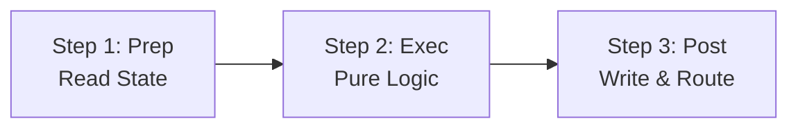

# Pocket

[](https://pkg.go.dev/github.com/agentstation/pocket)
[](https://goreportcard.com/report/github.com/agentstation/pocket)
[](https://github.com/agentstation/pocket/actions)
[](https://codecov.io/gh/agentstation/pocket)
[](https://opensource.org/licenses/MIT)
[](https://github.com/agentstation/pocket)

A minimalist LLM decision graph framework for Go. Build composable workflows with powerful decision graphs, type safety, and clean separation of concerns.

**Key Features:**
- 🎯 **Decision graphs** - Dynamic routing based on runtime logic
- 🔒 **Type safety** - Optional compile-time type checking with generics
- 🚀 **Built-in concurrency** - Native Go goroutines and patterns
- 📦 **Minimal dependencies** - Concurrency primitives: `golang.org/x/sync`, YAML parsing: [goccy/go-yaml](https://github.com/goccy/go-yaml)
- 🔧 **Interface-based** - Extensible architecture, graphs as nodes
- 🛡️ **Production ready** - Error handling, retries, observability
- 🔌 **Plugin system** - Built-in nodes, Lua scripting, and WebAssembly plugins

## 📚 Documentation

- **[Getting Started Guide](docs/guides/GETTING_STARTED.md)** - Your first Pocket workflow
- **[Full Documentation](docs/README.md)** - Complete guide with examples and patterns
- **[API Reference](docs/reference/API.md)** - Complete API documentation with examples

## Installation

### As a Library

```bash
go get github.com/agentstation/pocket
```

### As a CLI Tool

```bash
# Install the Pocket CLI
go install github.com/agentstation/pocket/cmd/pocket@latest

# Or clone and build from source
git clone https://github.com/agentstation/pocket.git
cd pocket
make build
```

## Quick Start

```go
package main

import (
    "context"
    "fmt"
    "github.com/agentstation/pocket"
)

func main() {
    // Create a simple greeting node
    greet := pocket.NewNode[string, string]("greet",
        pocket.WithExec(func(ctx context.Context, name string) (string, error) {
            return fmt.Sprintf("Hello, %s!", name), nil
        }),
    )
    
    // Run it
    store := pocket.NewStore()
    graph := pocket.NewGraph(greet, store)
    
    result, _ := graph.Run(context.Background(), "World")
    fmt.Println(result) // "Hello, World!"
}
```

Want more? Check out the [Getting Started Guide](docs/guides/GETTING_STARTED.md) for a complete walkthrough.

## Core Concepts

### The Prep-> Exec-> Post Pattern

Every Pocket node follows a three-phase lifecycle:

- **Prep**: Read-only state access, input validation
- **Exec**: Pure business logic, no side effects
- **Post**: Write state, determine next node



[Learn more about the Prep/Exec/Post pattern →](docs/concepts/PREP_EXEC_POST.md)

### Type Safety

Pocket provides three levels of type safety:

1. **Compile-time** with Go generics
2. **Initialization-time** with graph validation
3. **Runtime** type checking

```go
// Compile-time safety
node := pocket.NewNode[User, Response]("process",
    pocket.WithExec(func(ctx context.Context, user User) (Response, error) {
        return processUser(user), nil
    }),
)

// Validate your entire graph
if err := pocket.ValidateGraph(startNode); err != nil {
    log.Fatal(err) // Type mismatch detected!
}
```

[Deep dive into type safety →](docs/guides/TYPE_SAFETY.md)

### Building Workflows

Connect nodes to create complex workflows:

```go
// Create nodes
validate := pocket.NewNode[User, ValidationResult]("validate", ...)
process := pocket.NewNode[ValidationResult, ProcessedUser]("process", ...)
notify := pocket.NewNode[ProcessedUser, NotifyResult]("notify", ...)

// Connect them
validate.Connect("valid", process)
validate.Connect("invalid", errorHandler)
process.Connect("success", notify)

// Build and run
graph := pocket.NewGraph(validate, store)
result, err := graph.Run(ctx, user)
```

[Explore workflow patterns →](docs/patterns/WORKFLOW_PATTERNS.md)

## Features

### 🧩 Composable Architecture

- **Node as Interface**: Graphs implement the Node interface, enabling natural composition
- **Graph as Node**: Nest workflows within workflows seamlessly
- **Custom Nodes**: Implement your own node types
- **Plugin System**: Extend with WebAssembly plugins in any language

[Learn about the architecture →](docs/concepts/ARCHITECTURE.md)

### 🔄 State Management

- **Bounded Store**: Built-in LRU eviction and TTL support
- **Thread-Safe**: Concurrent access handled automatically
- **Scoped Stores**: Isolate state by workflow or component

[State management guide →](docs/guides/STATE_MANAGEMENT.md)

### ⚡ Concurrency Patterns

Built-in patterns for parallel processing:

```go
// Fan-out: Process items in parallel
results, err := pocket.FanOut(ctx, processor, store, items)

// Pipeline: Chain operations
result, err := pocket.Pipeline(ctx, nodes, store, input)
```

[Explore concurrency patterns →](docs/patterns/CONCURRENCY.md)

### 🛡️ Error Handling & Resilience

- **Retries**: Configurable retry with backoff
- **Fallbacks**: Graceful degradation
- **Circuit Breakers**: Protect external services
- **Timeouts**: Prevent hanging operations

[Error handling guide →](docs/guides/ERROR_HANDLING.md)
## 🧪 Plugin System (Experimental)

Pocket includes a powerful plugin system that enables extending the framework with custom nodes:

### Built-in Nodes
14 production-ready nodes included:
- **Core**: echo, delay, router, conditional
- **Data**: transform, template, jsonpath, validate, aggregate  
- **I/O**: http, file, exec
- **Flow**: parallel, lua

### Lua Scripting
Write custom logic in sandboxed Lua scripts:

```yaml
nodes:
  - name: process
    type: lua
    config:
      script: |
        local result = {
          status = input.value > 0.5 and "high" or "low",
          processed = true
        }
        return result
```

### WebAssembly Plugins

Extend Pocket with plugins written in any language that compiles to WebAssembly:

```yaml
# TypeScript plugin
- name: sentiment-analyzer
  type: sentiment
  config:
    threshold: 0.7

# Rust plugin  
- name: word-counter
  type: word-count
  config:
    min_word_length: 3
    
# Go plugin
- name: json-transformer
  type: json-transform
  config:
    transforms:
      flatten:
        type: flatten
        parameters:
          separator: "."
```

Install and manage plugins with the CLI:

```bash
# Install a plugin
pocket plugins install ./my-plugin.wasm

# List installed plugins
pocket plugins list

# Get plugin info
pocket plugins info sentiment-analyzer
```

[Plugin documentation →](docs/PLUGINS.md) | [Create your own plugin →](docs/PLUGIN_SDK_API.md)

## Examples

### Basic Workflow

```go
// Create nodes
validate := pocket.NewNode[Order, ValidationResult]("validate",
    pocket.WithExec(validateOrder),
)

process := pocket.NewNode[ValidationResult, ProcessedOrder]("process",
    pocket.WithExec(processOrder),
)

notify := pocket.NewNode[ProcessedOrder, NotifyResult]("notify",
    pocket.WithExec(sendNotification),
)

// Connect workflow
validate.Connect("valid", process)
validate.Connect("invalid", handleError)
process.Connect("success", notify)

// Run
graph := pocket.NewGraph(validate, pocket.NewStore())
result, err := graph.Run(ctx, order)
```

### Agent Pattern

```go
// Think-Act loop
think := pocket.NewNode[Context, Decision]("think",
    pocket.WithExec(analyzeContext),
    pocket.WithPost(func(ctx context.Context, store pocket.StoreWriter,
        input Context, prep, decision any) (Decision, string, error) {
        
        d := decision.(Decision)
        store.Set(ctx, "lastDecision", d)
        return d, d.Action, nil // Route to action
    }),
)

// Connect actions
think.Connect("research", researchNode)
think.Connect("execute", executeNode)
think.Connect("plan", planNode)

// Actions loop back to think
researchNode.Connect("done", think)
executeNode.Connect("done", think)
planNode.Connect("done", think)
```

[More examples →](examples/)

## Patterns

- **[Agent Patterns](docs/patterns/AGENT_PATTERNS.md)** - Autonomous agents, think-act loops
- **[Workflow Patterns](docs/patterns/WORKFLOW_PATTERNS.md)** - Sagas, compensation, orchestration
- **[Concurrency Patterns](docs/patterns/CONCURRENCY.md)** - Fan-out/in, pipelines, batching
- **[Batch Processing](docs/patterns/BATCH_PROCESSING.md)** - Map-reduce, parallel processing

## Advanced Topics

- **[Middleware](docs/advanced/MIDDLEWARE.md)** - Logging, metrics, tracing
- **[YAML Integration](docs/advanced/YAML_INTEGRATION.md)** - Declarative workflows
- **[Custom Nodes](docs/advanced/CUSTOM_NODES.md)** - Extend the framework
- **[Performance](docs/advanced/PERFORMANCE.md)** - Optimization guide

## Experimental

> **⚠️ Experimental Features**: The following features are experimental and subject to change.

### CLI

Run workflows from YAML files:

```bash
# Run a workflow
pocket run workflow.yaml

# With verbose output
pocket run workflow.yaml --verbose

# Validate without executing
pocket run workflow.yaml --dry-run

# Script management commands
pocket scripts                       # List discovered scripts
pocket scripts validate <path>       # Validate a Lua script
pocket scripts info <name>          # Show script details
pocket scripts run <name> [input]   # Run a script directly
```

Example workflow (`hello.yaml`):
```yaml
name: hello-world
description: My first Pocket workflow
version: "1.0.0"
start: greet

nodes:
  - name: greet
    type: echo
    config:
      message: "Hello, Pocket!"

  - name: complete
    type: echo
    config:
      message: "Workflow complete!"

connections:
  - from: greet
    to: complete
    action: default
```

See [CLI examples](examples/cli/) for more workflow examples and [CLI documentation](docs/advanced/CLI.md) for detailed information.

### Plugins

Pocket supports three types of plugins:

#### 1. Built-in Nodes
Pocket includes 14 built-in node types for common operations:
- **Core**: echo, delay, conditional, router
- **Data**: transform, template, jsonpath, aggregate, validate
- **I/O**: http, file, exec
- **Flow**: parallel
- **Script**: lua

#### 2. Lua Scripts
Write custom logic in Lua with sandboxed execution:

```lua
-- ~/.pocket/scripts/data_processor.lua
-- @name: data-processor
-- @category: data
-- @description: Process data with custom logic

function exec(input)
    -- Your custom logic here
    return {
        processed = true,
        original = input,
        timestamp = os.time()
    }
end
```

#### 3. WebAssembly (WASM) Plugins
Build plugins in any language that compiles to WASM:

```bash
# Plugin management is built into the main CLI
pocket plugins list                  # List installed plugins
pocket plugins info <plugin>         # Show plugin details
pocket plugins install <path>        # Install a plugin
pocket plugins remove <plugin>       # Remove a plugin
```

Example WASM plugin structure:
```
~/.pocket/plugins/
  my-plugin/
    manifest.yaml    # Plugin metadata
    plugin.wasm     # Compiled WebAssembly
    README.md       # Documentation
```

Supported languages for WASM plugins:
- **TypeScript/JavaScript** - Using Javy for compilation
- **Rust** - Native WASM support with wasm-bindgen
- **Go** - Using TinyGo or regular Go with WASM target
- **Any language** that compiles to WASM

For detailed plugin development guides, see:
- [Plugin System Overview](docs/PLUGIN_SYSTEM.md)
- [Plugin Development Guide](docs/PLUGINS.md)
- [Plugin Examples](plugin/examples/)

## Testing

```bash
# Run all tests with race detection
go test -race ./...

# Run with coverage
go test -cover ./...

# Run benchmarks
go test -bench=. -benchmem ./...

# Generate coverage report
go test -coverprofile=coverage.out ./...
go tool cover -html=coverage.out
```

[Testing guide →](docs/guides/TESTING.md)

## Contributing

We welcome contributions! Pocket is built by the community, for the community.

1. Fork the repository
2. Create your feature branch (`git checkout -b feature/amazing`)
3. Write tests for your changes
4. Ensure all tests pass (`go test -race ./...`)
5. Commit your changes (`git commit -m 'Add amazing feature'`)
6. Push to the branch (`git push origin feature/amazing`)
7. Open a Pull Request

See [CONTRIBUTING.md](CONTRIBUTING.md) for detailed guidelines.

## Performance

Pocket is designed for production performance:

- Zero allocations in hot paths
- Minimal overhead for node execution
- Efficient concurrent patterns
- Comprehensive benchmarks

```bash
# Run benchmarks
go test -bench=. -benchmem ./...
```

## License

MIT - see [LICENSE](LICENSE) for details.

## Acknowledgments

- Inspired by minimalist workflow patterns
- Built for Go's production requirements
- Built with ❤️ by [AgentStation](https://agentstation.ai)