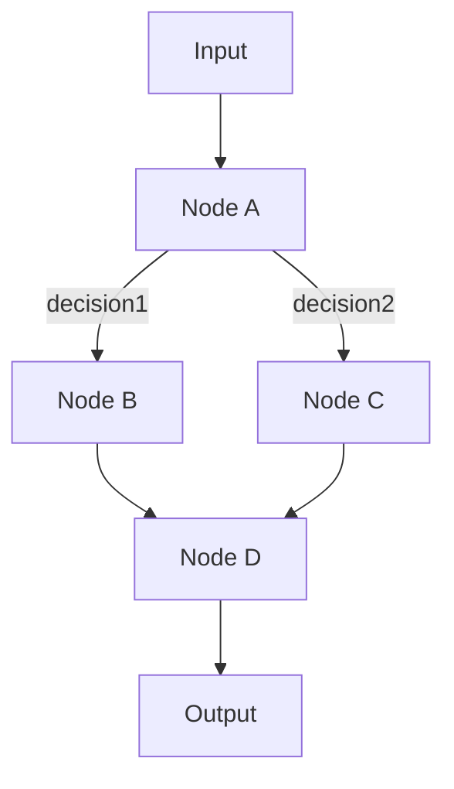

# Pocket Architecture: Graph Execution Engine

## Overview

Pocket is a graph execution engine designed for building and running LLM workflows. As a language-agnostic execution engine, Pocket processes workflow definitions (in YAML/JSON or Go code) by executing them as directed graphs where nodes perform computations and edges represent decision paths.

The engine provides:
- **Language-agnostic execution** via YAML/JSON workflow definitions
- **Native Go embedding** for applications requiring programmatic control
- **Plugin system** supporting Lua, WebAssembly, and native Go extensions
- **Production-ready features** including retries, timeouts, and state management

## Core Design Principles

### 1. Graph-Based Execution Model

The Pocket engine executes workflows as directed graphs where:
- **Nodes** represent units of computation (built-in, plugin, or custom)
- **Edges** represent decision paths between nodes
- **Execution** flows through the graph based on runtime decisions
- **State** is managed by the engine across node executions



### 2. Interface-Based Design

The `Node` interface is the foundation of Pocket's extensibility:

```go
type Node interface {
    Name() string
    Prep(ctx context.Context, store StoreReader, input any) (any, error)
    Exec(ctx context.Context, prepResult any) (any, error)
    Post(ctx context.Context, store StoreWriter, input, prepResult, execResult any) (any, string, error)
    Connect(action string, next Node) Node
    Successors() map[string]Node
    InputType() reflect.Type
    OutputType() reflect.Type
}
```

This design enables:
- **Polymorphism**: Different node implementations can be used interchangeably
- **Composition**: Graphs implement Node, allowing nested workflows
- **Extensibility**: Custom node types can be created for specific needs

### 3. Separation of Concerns

Each node execution follows three distinct phases:

1. **Prep**: Read-only state access, input validation
2. **Exec**: Pure business logic, no side effects
3. **Post**: State mutations, routing decisions

This separation ensures:
- **Testability**: Business logic is isolated and pure
- **Predictability**: State changes occur in controlled phases
- **Concurrency Safety**: Read operations can parallelize safely

### 4. Type Safety

Pocket provides multiple layers of type safety:

```go
// Compile-time safety with generics
node := pocket.NewNode[Input, Output]("processor", ...)

// Initialization-time validation
err := pocket.ValidateGraph(startNode)

// Runtime type checking for dynamic scenarios
```

## Key Components

### Node

The fundamental unit of computation. Nodes:
- Process input data
- Make decisions about next steps
- Can be composed into larger workflows

### Graph

A container that orchestrates node execution:
- Manages execution flow
- Provides state storage
- Handles error propagation
- Implements the Node interface (enabling composition)

### Store

Thread-safe state management with:
- Key-value storage
- Scoped access
- Optional bounds (LRU, TTL)
- Read/write separation

### Builder

Fluent API for constructing graphs:
```go
graph, err := pocket.NewBuilder(store).
    Add(nodeA).
    Add(nodeB).
    Connect("nodeA", "success", "nodeB").
    Start("nodeA").
    Build()
```

## Execution Engine Model

### 1. Graph Execution

The engine starts execution at a designated start node and traverses the graph based on runtime decisions:

```go
// Programmatic execution
graph := pocket.NewGraph(startNode, store)
result, err := graph.Run(ctx, input)
```

```bash
# CLI execution
pocket run workflow.yaml --input data.json
```

### 2. Decision Routing

Nodes determine the next step dynamically in their Post phase:

```go
func (n *node) Post(ctx context.Context, store StoreWriter, input, prep, exec any) (any, string, error) {
    // Routing logic based on execution results
    if exec.(Result).Success {
        return exec, "success", nil  // Route to "success" edge
    }
    return exec, "failure", nil      // Route to "failure" edge
}
```

### 3. State Management

The store provides isolated state for each graph execution:

```go
// Scoped stores for isolation
userStore := store.Scope("user")
userStore.Set(ctx, "123", userData)

// Bounded stores for memory management
bounded := pocket.NewStore(
    pocket.WithMaxEntries(1000),
    pocket.WithTTL(5 * time.Minute),
)
```

## Concurrency Model

Pocket leverages Go's concurrency primitives:

### Fan-Out Pattern
```go
// Process items in parallel
results, err := pocket.FanOut(ctx, processor, store, items)
```

### Pipeline Pattern
```go
// Chain operations sequentially
result, err := pocket.Pipeline(ctx, nodes, store, input)
```

### Concurrent Execution
```go
// Run independent nodes in parallel
results, err := pocket.RunConcurrent(ctx, nodes, store)
```

## Error Handling

Pocket provides multiple strategies for resilience:

1. **Retries**: Automatic retry with backoff
2. **Fallbacks**: Alternative paths on failure
3. **Circuit Breakers**: Protect against cascading failures
4. **Compensation**: Rollback mechanisms for sagas

## Extensibility Points

### Custom Nodes

Implement the Node interface for specialized behavior:

```go
type CustomNode struct {
    // Custom fields
}

func (n *CustomNode) Prep(ctx context.Context, store StoreReader, input any) (any, error) {
    // Custom prep logic
}

// Implement other Node methods...
```

### Middleware

Wrap nodes with cross-cutting concerns:

```go
logged := middleware.WithLogging(node, logger)
traced := middleware.WithTracing(node, tracer)
```

### Hooks

Lifecycle hooks for monitoring and debugging:

```go
node := pocket.NewNode[any, any]("monitored",
    pocket.WithOnSuccess(successHandler),
    pocket.WithOnFailure(failureHandler),
    pocket.WithOnComplete(cleanupHandler),
)
```

## Design Rationale

### Why Graphs?

Graphs naturally represent:
- **Decision Trees**: Multiple paths based on conditions
- **State Machines**: Transitions between states
- **Workflows**: Sequential and parallel operations
- **Agent Behaviors**: Complex decision-making loops

### Why Interface-Based?

Using Node as an interface enables:
- **Flexibility**: Different implementations for different needs
- **Composition**: Graphs as nodes for hierarchical workflows
- **Testing**: Easy mocking and stubbing
- **Evolution**: Add capabilities without breaking existing code

### Why Prep/Exec/Post?

This pattern enforces:
- **Clear Boundaries**: Each phase has specific responsibilities
- **Pure Functions**: Business logic isolated from side effects
- **Controlled State**: Mutations happen predictably
- **Better Testing**: Each phase can be tested independently

## Performance Considerations

Pocket is designed for production performance:

- **Zero Allocations**: In hot paths where possible
- **Minimal Overhead**: Thin abstraction layer
- **Efficient Concurrency**: Leverages Go's runtime
- **Bounded Resources**: Memory limits prevent runaway growth

## Summary

Pocket's graph execution engine provides:
- **Language Agnostic**: Execute workflows from YAML/JSON without writing code
- **Embeddable Engine**: Integrate the execution engine into Go applications
- **Extensible Architecture**: Add custom nodes via plugins (Lua, WASM, Go)
- **Production Ready**: Built-in retries, timeouts, state management, and error handling
- **Type Safe**: Optional compile-time type checking for Go integrations

The engine's architecture combines:
1. **Graph-based execution model** for natural workflow representation
2. **Interface polymorphism** enabling graphs as composable nodes
3. **Prep/Exec/Post lifecycle** for clean separation of concerns
4. **Plugin system** for language-agnostic extensibility

This design creates a powerful execution engine suitable for everything from simple automation scripts to sophisticated LLM agent orchestration, while maintaining simplicity and testability.