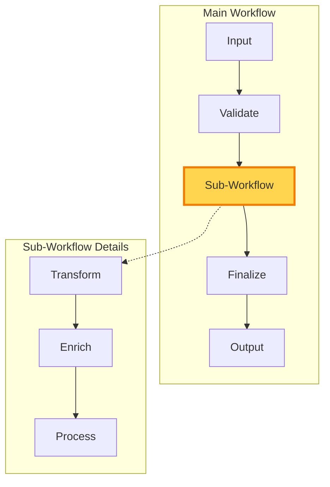
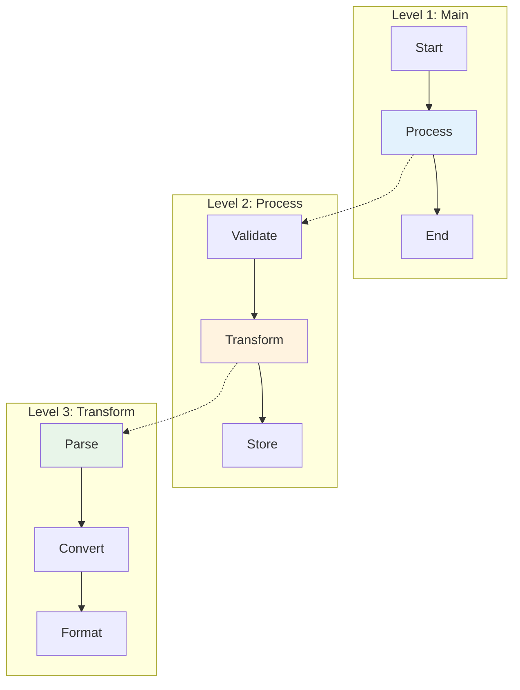

# Graph Composition in the Execution Engine

## Overview

A key architectural feature of Pocket's execution engine is that `Graph` implements the `Node` interface. This means graphs can be used anywhere nodes are expected, enabling the engine to execute hierarchically composed workflows without special handling.

## Graphs as Nodes

### The Key Insight

```go
// Both implement the Node interface
var n1 Node = pocket.NewNode[In, Out]("simple", ...)
var n2 Node = pocket.NewGraph(startNode, store)

// They can be used interchangeably
processor.Connect("next", n1)  // Connect to a node
processor.Connect("next", n2)  // Connect to a graph - works the same!
```

### How It Works

When a graph implements Node:
- `Name()` returns the start node's name
- `Exec()` runs the entire graph workflow
- `Prep()` delegates to the start node
- `Post()` delegates to the final node
- The graph maintains its own isolated state

```go
// Simplified graph implementation
func (g *Graph) Exec(ctx context.Context, input any) (any, error) {
    // Runs the entire graph workflow
    return g.Run(ctx, input)
}

func (g *Graph) Connect(action string, next Node) Node {
    // Connects the graph's terminal nodes to the next node
    g.connectTerminals(action, next)
    return g
}
```

## Composition Patterns

### 1. Basic Composition

Embed sub-workflows within larger workflows:



```go
// Create a sub-workflow
transform := pocket.NewNode[Data, Transformed]("transform", ...)
enrich := pocket.NewNode[Transformed, Enriched]("enrich", ...)
process := pocket.NewNode[Enriched, Processed]("process", ...)

transform.Connect("default", enrich)
enrich.Connect("default", process)

subWorkflow := pocket.NewGraph(transform, pocket.NewStore())

// Use in main workflow
validate := pocket.NewNode[Input, Data]("validate", ...)
finalize := pocket.NewNode[Processed, Output]("finalize", ...)

validate.Connect("valid", subWorkflow)    // Direct connection!
subWorkflow.Connect("default", finalize)   // Graph connects like a node

mainWorkflow := pocket.NewGraph(validate, pocket.NewStore())
```

### 2. Reusable Components

Create reusable workflow components:

```go
// Reusable authentication workflow
func NewAuthWorkflow(authService AuthService) Node {
    checkToken := pocket.NewNode[Request, TokenStatus]("check-token",
        pocket.WithExec(func(ctx context.Context, req Request) (TokenStatus, error) {
            return authService.ValidateToken(req.Token)
        }),
    )
    
    refreshToken := pocket.NewNode[TokenStatus, AuthResult]("refresh",
        pocket.WithExec(func(ctx context.Context, status TokenStatus) (AuthResult, error) {
            if status.Expired {
                return authService.Refresh(status.Token)
            }
            return AuthResult{Valid: true}, nil
        }),
    )
    
    checkToken.Connect("default", refreshToken)
    
    return pocket.NewGraph(checkToken, pocket.NewStore())
}

// Use in multiple workflows
authWorkflow := NewAuthWorkflow(authService)

apiWorkflow := pocket.NewNode[Request, Response]("api",
    pocket.WithPost(func(ctx context.Context, store StoreWriter, req Request, prep, exec any) (Response, string, error) {
        if req.RequiresAuth {
            return Response{}, "auth", nil
        }
        return Response{}, "process", nil
    }),
)

apiWorkflow.Connect("auth", authWorkflow)
apiWorkflow.Connect("process", processNode)
```

### 3. Dynamic Composition

Build graphs dynamically based on configuration:

```go
func BuildPipeline(config PipelineConfig) Node {
    var previous Node
    
    for i, stage := range config.Stages {
        node := createNodeForStage(stage)
        
        if i == 0 {
            previous = node
        } else {
            previous.Connect("default", node)
            previous = node
        }
    }
    
    return pocket.NewGraph(config.Stages[0], pocket.NewStore())
}

// Usage
etlPipeline := BuildPipeline(PipelineConfig{
    Stages: []StageConfig{
        {Type: "extract", Source: "database"},
        {Type: "transform", Rules: transformRules},
        {Type: "validate", Schema: schema},
        {Type: "load", Target: "warehouse"},
    },
})
```

### 4. Hierarchical Workflows

Build complex hierarchies with multiple levels:



```go
// Level 3: Transform sub-workflow
parseNode := pocket.NewNode[Raw, Parsed]("parse", ...)
convertNode := pocket.NewNode[Parsed, Converted]("convert", ...)
formatNode := pocket.NewNode[Converted, Formatted]("format", ...)

parseNode.Connect("default", convertNode)
convertNode.Connect("default", formatNode)

transformGraph := pocket.NewGraph(parseNode, pocket.NewStore())

// Level 2: Process workflow
validateNode := pocket.NewNode[Input, Valid]("validate", ...)
storeNode := pocket.NewNode[Formatted, Stored]("store", ...)

validateNode.Connect("valid", transformGraph)
transformGraph.Connect("default", storeNode)

processGraph := pocket.NewGraph(validateNode, pocket.NewStore())

// Level 1: Main workflow
startNode := pocket.NewNode[Request, Input]("start", ...)
endNode := pocket.NewNode[Stored, Response]("end", ...)

startNode.Connect("process", processGraph)
processGraph.Connect("default", endNode)

mainGraph := pocket.NewGraph(startNode, pocket.NewStore())
```

## State Isolation

### Graph State Scoping

Each graph maintains its own state scope:

```go
// Each graph has isolated state
subGraph1 := pocket.NewGraph(node1, pocket.NewStore())
subGraph2 := pocket.NewGraph(node2, pocket.NewStore())

// State changes in subGraph1 don't affect subGraph2
```

### Sharing State

When needed, share state explicitly:

```go
// Shared parent store
parentStore := pocket.NewStore()

// Create scoped stores for sub-graphs
subStore1 := parentStore.Scope("workflow1")
subStore2 := parentStore.Scope("workflow2")

subGraph1 := pocket.NewGraph(node1, subStore1)
subGraph2 := pocket.NewGraph(node2, subStore2)

// Both can access parent store with their prefixes
```

## Advanced Composition Techniques

### 1. Conditional Sub-Workflows

```go
routerNode := pocket.NewNode[Request, Response]("router",
    pocket.WithPrep(func(ctx context.Context, store StoreReader, req Request) (any, error) {
        // Determine which workflow to use
        workflowType := determineWorkflow(req)
        return map[string]any{
            "request": req,
            "type":    workflowType,
        }, nil
    }),
    pocket.WithPost(func(ctx context.Context, store StoreWriter, req Request, prep, exec any) (Response, string, error) {
        data := prep.(map[string]any)
        return Response{}, data["type"].(string), nil
    }),
)

// Connect different workflows
routerNode.Connect("simple", simpleWorkflow)
routerNode.Connect("complex", complexWorkflow)
routerNode.Connect("advanced", advancedWorkflow)
```

### 2. Recursive Composition

Graphs can contain instances of themselves for recursive patterns:

```go
// Tree traversal workflow
var traverseTree Node

processNode := pocket.NewNode[TreeNode, Result]("process",
    pocket.WithExec(func(ctx context.Context, node TreeNode) (Result, error) {
        return processTreeNode(node), nil
    }),
    pocket.WithPost(func(ctx context.Context, store StoreWriter, input TreeNode, prep, result Result) (Result, string, error) {
        if len(input.Children) > 0 {
            // Process children recursively
            for _, child := range input.Children {
                // This would trigger traverseTree again
                store.Set(ctx, "pending", child)
            }
            return result, "traverse-children", nil
        }
        return result, "done", nil
    }),
)

// Create the recursive structure
traverseTree = pocket.NewGraph(processNode, pocket.NewStore())
processNode.Connect("traverse-children", traverseTree)
```

### 3. Parallel Sub-Workflows

Execute multiple sub-workflows concurrently:

```go
parallelProcessor := pocket.NewNode[BatchRequest, BatchResponse]("parallel",
    pocket.WithExec(func(ctx context.Context, batch BatchRequest) (BatchResponse, error) {
        var wg sync.WaitGroup
        results := make([]Result, len(batch.Items))
        errors := make([]error, len(batch.Items))
        
        for i, item := range batch.Items {
            wg.Add(1)
            go func(idx int, data Item) {
                defer wg.Done()
                
                // Each item processed by a sub-workflow
                subGraph := createProcessingGraph()
                result, err := subGraph.Exec(ctx, data)
                
                results[idx] = result.(Result)
                errors[idx] = err
            }(i, item)
        }
        
        wg.Wait()
        
        return BatchResponse{
            Results: results,
            Errors:  errors,
        }, nil
    }),
)
```

### 4. Graph Templates

Create parameterized graph templates:

```go
type GraphTemplate struct {
    validators map[string]Node
    processors map[string]Node
    outputs    map[string]Node
}

func (t *GraphTemplate) Build(config GraphConfig) Node {
    // Select components based on config
    validator := t.validators[config.ValidatorType]
    processor := t.processors[config.ProcessorType]
    output := t.outputs[config.OutputType]
    
    // Connect them
    validator.Connect("valid", processor)
    processor.Connect("default", output)
    
    // Add optional components
    if config.EnableCache {
        cache := pocket.NewNode[any, any]("cache", ...)
        processor.Connect("default", cache)
        cache.Connect("default", output)
    }
    
    return pocket.NewGraph(validator, pocket.NewStore())
}
```

## Best Practices

### 1. Name Sub-Workflows Clearly

```go
// Good: Descriptive names for sub-workflows
authWorkflow := pocket.NewGraph(authStart, store)
authWorkflow.AsNode("user-authentication")  // Optional: explicit naming

// The graph's name helps with debugging
```

### 2. Document Graph Boundaries

```go
// Document what a sub-workflow expects and produces
// UserEnrichmentWorkflow enriches user data with profile information.
// Input: User{ID, Email}
// Output: EnrichedUser{User, Profile, Preferences}
func UserEnrichmentWorkflow() Node {
    // ... implementation
}
```

### 3. Keep Sub-Workflows Focused

Each sub-workflow should have a single, clear purpose:

```go
// Good: Focused sub-workflows
validationWorkflow := BuildValidationWorkflow()
enrichmentWorkflow := BuildEnrichmentWorkflow()
notificationWorkflow := BuildNotificationWorkflow()

// Avoid: Kitchen-sink sub-workflows
everythingWorkflow := BuildDoEverythingWorkflow() // Too broad
```

### 4. Test Sub-Workflows Independently

```go
func TestAuthWorkflow(t *testing.T) {
    authWorkflow := NewAuthWorkflow(mockAuthService)
    
    testCases := []struct {
        name     string
        input    Request
        expected AuthResult
    }{
        {"valid token", validRequest, successResult},
        {"expired token", expiredRequest, refreshedResult},
        {"invalid token", invalidRequest, failureResult},
    }
    
    for _, tc := range testCases {
        t.Run(tc.name, func(t *testing.T) {
            result, err := authWorkflow.Exec(context.Background(), tc.input)
            // Assert expectations
        })
    }
}
```

## Performance Considerations

### 1. Graph Overhead

Each graph has minimal overhead:
- Small memory footprint for graph structure
- Negligible execution overhead
- State isolation has minor memory cost

### 2. Deep Nesting

While possible, avoid excessive nesting:

```go
// Reasonable: 2-3 levels
mainGraph → subGraph → leafNodes

// Avoid: Too many levels
mainGraph → subGraph1 → subGraph2 → subGraph3 → subGraph4 → leafNodes
```

### 3. State Store Sizing

Consider store size for deeply nested graphs:

```go
// For deep hierarchies, use bounded stores
store := pocket.NewStore(
    pocket.WithMaxEntries(10000),
    pocket.WithTTL(5 * time.Minute),
)
```

## Summary

Graph composition in Pocket enables:

1. **Natural Hierarchies**: Build complex workflows from simple parts
2. **Reusability**: Create workflow components used across projects
3. **Modularity**: Test and reason about sub-workflows independently
4. **Flexibility**: Compose workflows dynamically at runtime
5. **Clean Architecture**: Organize complex logic into manageable pieces

The fact that graphs are nodes is not just an implementation detail—it's a fundamental design principle that makes Pocket powerful yet simple.