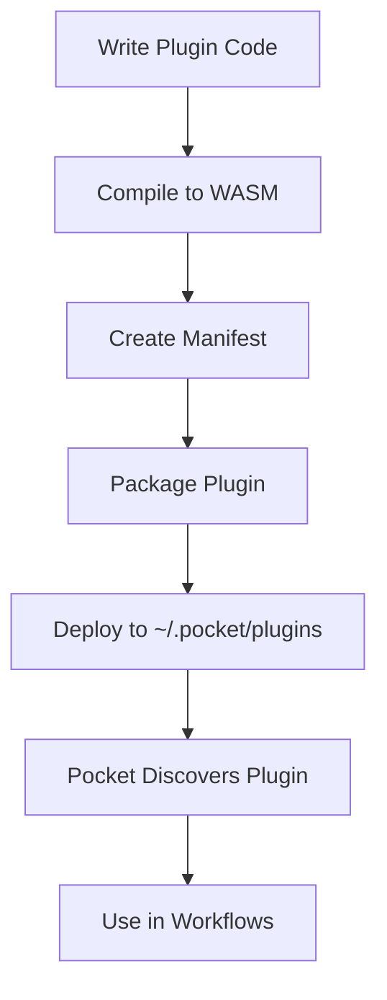

# WebAssembly Plugin Development (Coming Soon)

> **Note**: WebAssembly plugin support is planned for Phase 3 of the Pocket plugin system. This document outlines the planned features and development workflow.

## Overview

WebAssembly (WASM) plugins will enable developers to write Pocket nodes in any language that compiles to WebAssembly, including:

- TypeScript/JavaScript
- Rust
- Go
- C/C++
- AssemblyScript
- And many more

## Planned Features

### 1. Language Support

#### TypeScript/JavaScript
- First-class support via Javy or similar compilers
- NPM package: `@pocket/plugin-sdk`
- TypeScript definitions for full type safety
- Familiar async/await patterns

#### Rust
- Use wasm-bindgen for easy integration
- Cargo template for quick starts
- Full access to Rust's performance

#### Go
- Compile with TinyGo
- Reuse existing Go knowledge
- Share code between native and WASM nodes

### 2. Development Workflow



### 3. Plugin SDK

The planned SDK will provide:

```typescript
// @pocket/plugin-sdk
export abstract class PluginNode {
  abstract exec(input: any): Promise<any>;
  
  // Optional lifecycle methods
  prep?(input: any): Promise<any>;
  post?(input: any, result: any): Promise<{output: any, next: string}>;
  
  // Metadata
  abstract getMetadata(): NodeMetadata;
}

export interface NodeMetadata {
  type: string;
  category: string;
  description: string;
  configSchema: JSONSchema;
  examples?: Example[];
}
```

### 4. Security Model

#### Capability-Based Permissions
```yaml
permissions:
  - network: ["api.example.com", "*.trusted-domain.com"]
  - env: ["API_KEY", "SERVICE_URL"]
  - filesystem: ["read:/data", "write:/tmp"]
  - memory: 100MB
  - cpu: 1000ms
```

#### Sandboxing
- Memory isolation
- No direct system calls
- Controlled resource access
- Timeout enforcement

## Example: TypeScript Plugin

### 1. Write Plugin Code

```typescript
// src/sentiment-analyzer.ts
import { PluginNode, NodeMetadata } from '@pocket/plugin-sdk';

interface Input {
  text: string;
  lang?: string;
}

interface Output {
  sentiment: 'positive' | 'negative' | 'neutral';
  score: number;
  confidence: number;
}

export class SentimentAnalyzer extends PluginNode {
  async exec(input: Input): Promise<Output> {
    const text = input.text.toLowerCase();
    
    // Simple sentiment analysis
    const positiveWords = ['good', 'great', 'excellent', 'love', 'wonderful'];
    const negativeWords = ['bad', 'terrible', 'hate', 'awful', 'horrible'];
    
    let score = 0;
    const words = text.split(/\s+/);
    
    for (const word of words) {
      if (positiveWords.includes(word)) score += 1;
      if (negativeWords.includes(word)) score -= 1;
    }
    
    const normalizedScore = score / words.length;
    
    return {
      sentiment: normalizedScore > 0.1 ? 'positive' : 
                 normalizedScore < -0.1 ? 'negative' : 'neutral',
      score: normalizedScore,
      confidence: Math.min(Math.abs(normalizedScore) * 2, 1)
    };
  }
  
  getMetadata(): NodeMetadata {
    return {
      type: 'sentiment',
      category: 'ai',
      description: 'Analyzes text sentiment',
      configSchema: {
        type: 'object',
        properties: {
          threshold: {
            type: 'number',
            default: 0.1,
            description: 'Sentiment classification threshold'
          }
        }
      },
      examples: [{
        name: 'Analyze customer feedback',
        config: { threshold: 0.2 },
        input: { text: 'This product is absolutely wonderful!' },
        output: { sentiment: 'positive', score: 0.2, confidence: 0.4 }
      }]
    };
  }
}

// Export for plugin system
export default new SentimentAnalyzer();
```

### 2. Build Configuration

```json
// package.json
{
  "name": "pocket-sentiment-plugin",
  "version": "1.0.0",
  "scripts": {
    "build": "node build.js",
    "test": "jest"
  },
  "devDependencies": {
    "@pocket/plugin-sdk": "^1.0.0",
    "esbuild": "^0.19.0",
    "javy": "^1.0.0"
  }
}
```

```javascript
// build.js
const esbuild = require('esbuild');
const { execSync } = require('child_process');

// Bundle TypeScript to JavaScript
esbuild.buildSync({
  entryPoints: ['src/sentiment-analyzer.ts'],
  bundle: true,
  format: 'esm',
  outfile: 'dist/plugin.js',
  platform: 'neutral'
});

// Compile to WebAssembly
execSync('javy compile dist/plugin.js -o dist/plugin.wasm');

console.log('✅ Plugin built successfully!');
```

### 3. Plugin Manifest

```yaml
# manifest.yaml
name: sentiment-analyzer
version: 1.0.0
description: Sentiment analysis plugin for Pocket
author: Your Name
license: MIT

runtime: wasm
binary: plugin.wasm

nodes:
  - type: sentiment
    category: ai
    description: Analyze text sentiment with ML

requirements:
  pocket: ">=0.5.0"
  memory: 50MB

permissions:
  # No special permissions needed for this plugin
  memory: 50MB
  cpu: 100ms
```

### 4. Deployment

```bash
# Package plugin
tar -czf sentiment-analyzer.tar.gz manifest.yaml dist/plugin.wasm

# Install to Pocket
pocket plugins install sentiment-analyzer.tar.gz

# Or manually deploy
mkdir -p ~/.pocket/plugins/sentiment-analyzer
cp manifest.yaml dist/plugin.wasm ~/.pocket/plugins/sentiment-analyzer/
```

### 5. Usage in Workflows

```yaml
# workflow.yaml
name: customer-feedback-analysis
nodes:
  - name: analyze-feedback
    type: sentiment  # Your plugin node!
    config:
      threshold: 0.15
    
  - name: route-by-sentiment
    type: conditional
    config:
      conditions:
        - if: "{{eq .sentiment \"positive\"}}"
          then: thank-customer
        - if: "{{eq .sentiment \"negative\"}}"
          then: escalate-to-support
      else: archive-feedback
```

## Example: Rust Plugin

```rust
// src/lib.rs
use pocket_plugin_sdk::{PluginNode, NodeMetadata, JSONSchema};
use serde::{Deserialize, Serialize};

#[derive(Deserialize)]
struct Input {
    numbers: Vec<f64>,
}

#[derive(Serialize)]
struct Output {
    sum: f64,
    average: f64,
    min: f64,
    max: f64,
}

struct StatisticsNode;

impl PluginNode for StatisticsNode {
    fn exec(&self, input: Input) -> Result<Output, String> {
        if input.numbers.is_empty() {
            return Err("Input array is empty".to_string());
        }
        
        let sum: f64 = input.numbers.iter().sum();
        let average = sum / input.numbers.len() as f64;
        let min = input.numbers.iter().fold(f64::INFINITY, |a, &b| a.min(b));
        let max = input.numbers.iter().fold(f64::NEG_INFINITY, |a, &b| a.max(b));
        
        Ok(Output { sum, average, min, max })
    }
    
    fn metadata(&self) -> NodeMetadata {
        NodeMetadata {
            node_type: "statistics".to_string(),
            category: "math".to_string(),
            description: "Calculate statistics from number arrays".to_string(),
            config_schema: JSONSchema::default(),
        }
    }
}

// Export the plugin
pocket_plugin_sdk::export_plugin!(StatisticsNode);
```

## Plugin Discovery

Pocket will discover plugins from:

```
~/.pocket/plugins/
├── sentiment-analyzer/
│   ├── manifest.yaml
│   └── plugin.wasm
├── statistics/
│   ├── manifest.yaml
│   └── plugin.wasm
└── custom-llm/
    ├── manifest.yaml
    └── plugin.wasm
```

## CLI Integration

```bash
# List installed plugins
pocket plugins list

# Install a plugin
pocket plugins install https://example.com/plugin.tar.gz

# Remove a plugin
pocket plugins remove sentiment-analyzer

# Get plugin info
pocket plugins info sentiment-analyzer

# Validate a plugin
pocket plugins validate ./my-plugin/
```

## Performance Considerations

### Startup Time
- WASM modules are cached after first load
- Typical initialization: 50-200ms
- Hot path execution: 1-5ms overhead

### Memory Usage
- Each plugin runs in isolated memory
- Default limit: 100MB per plugin
- Configurable via manifest

### Best Practices
1. Keep plugins focused on single responsibilities
2. Minimize plugin size (use tree-shaking)
3. Cache expensive computations
4. Use streaming for large data

## Roadmap

### Phase 3.1 - Basic WASM Support
- [ ] WASM runtime integration
- [ ] Basic plugin loading
- [ ] JavaScript/TypeScript support via Javy
- [ ] Simple permission model

### Phase 3.2 - Advanced Features
- [ ] Rust and Go SDKs
- [ ] Plugin marketplace
- [ ] Hot reloading
- [ ] Debugging support

### Phase 3.3 - Enterprise Features
- [ ] Plugin signing and verification
- [ ] Private plugin registries
- [ ] Advanced security policies
- [ ] Performance profiling

## Contributing

Want to help build WebAssembly support? Here's how:

1. Review the [PLUGIN_SPEC.md](../../PLUGIN_SPEC.md)
2. Join discussions in GitHub Issues
3. Contribute to the design process
4. Help build the runtime when development begins

## See Also

- [Plugin System Overview](README.md)
- [Lua Scripting](LUA.md) - Available now!
- [Go Node Development](GO.md) - Native node development
- [WebAssembly on MDN](https://developer.mozilla.org/en-US/docs/WebAssembly) - Learn more about WASM